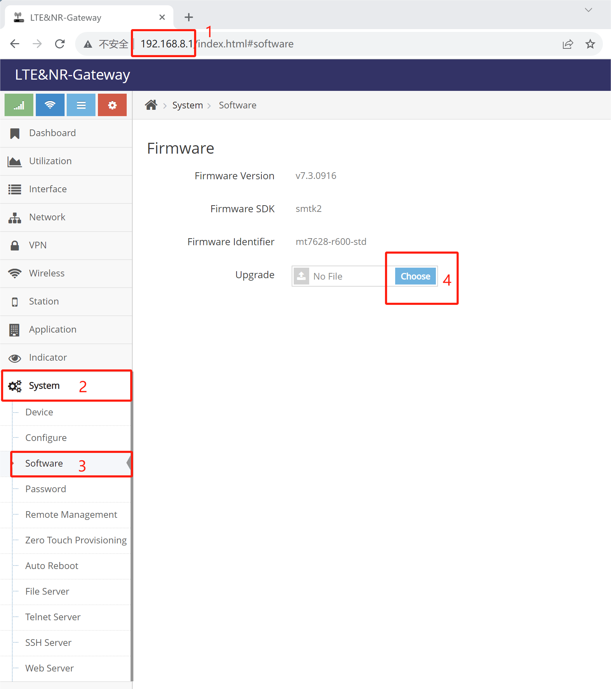

# SkinOS SDK下载与编译

#### 开发环境下载
在Ubuntu下（ 建议使用20.04或18.04 ）执行以下命令下载开发环境( 请先安装git及make )

```shell
git clone https://gitee.com/tiger7/tiger7.git

```

*或者从github上下载*

```shell
git clone https://github.com/skinos7/tiger7.git
```

#### 安装开发工具

```shell
cd tiger7
make ubuntu_preset
```
*此指令会协助安装一些常用的开发工具, 也就是执行以下执行来安装开发要用的工具, 如出现安装异常请跟据Ubuntu当前的环境手动安装*
```
sudo apt-get update
sudo apt-get install vim git subversion pandoc aptitude
sudo apt-get install gcc g++ binutils patch bzip2 flex bison make autoconf gettext texinfo unzip sharutils gawk
sudo apt-get install python2 libtool shtool curl lrzsz zlib1g-dev automake automake1.11
sudo apt-get install lib32z1 libssl-dev device-tree-compiler libevent-dev
sudo snap install ttyd --classic
sudo apt-get install lib32ncurses5
sudo apt-get install libncurses5-dev
sudo apt-get install libncursesw5-dev
```


#### 指定产品型号

```shell
make pid gBOARDID=<Product complete model>

# For products such as D218 enter the following instructions:
make pid gBOARDID=mtk2-mt7628-d218

# For products such as 2218/3218/5218 enter the following instructions:
make pid gBOARDID=mtk2-mt7628-r600

# For products such as D228 enter the following instructions:
make pid gBOARDID=mtk2-mt7621-d228

# For products such as D228P enter the following instructions:
make pid gBOARDID=mtk2-mt7621-d228p
```
*如果不清楚产品型号请咨询售技术支持*

#### 下载产品型号对应的代码及库文件

```shell
make update
```

#### 更新软件菜单

```shell
make menu
make menuconfig
```  
***注意: 显示菜单后直接退出并保存即可***

#### 编译网关固件

```shell
make dep
make
```
等待大约2至5个小时后会在tiger7/build目录下生成以 **.zz** 结尾的网关固件升级包


#### 将固件升级到网关
在网关网页管理界面中的 **系统=>软件管理=>软件更新** 来点选.zz结尾的固件升级包来升级固件




# SkinOS中项目架构介绍

为了方便在Linux下管理及开发可执行程序, 共享库, Skinos的组件, linux内核模块, 网页界面, Shell脚本及资源文件, Skinos以 **目录** 的方式将其统一存放以方便开发编译及打包成安装包, 并称之为 **项目**, 以下是项目通常包含的文件 

- 可执行程序, Linux下的可执行程序, 通过项目的方式创建将自动生成模板及编译脚本, 并会将编译后的二进制程序安装到运行系统中
- 共享库程序, Linux下的库程序, 通过项目的方式创建将自动生成模板及编译脚本, 并会将编译后的二进制库安装到运行系统中
- 组件程序, SkinOS组件, 向系统提供接口实现与SkinOS交互, 并会将编译后的二进制程序安装到运行系统中
- 网页界面程序, HTML网页文件, 通过项目的方式创建将自动生成模板及安装后直接显示在管理界面中生成菜单项(点击菜单项将显示对应的HTML网页)
- 开发Shell脚本, Linux下的Shell脚本文件, 项目目录下的Shell的脚本会自动安装到运行系统中
- 开发内核模块程序, Linux下的内模模块, 通过项目的方式创建将自动生成模板及编译脚本, 并会将编译后的二进制程序安装到运行系统中
- 放入其它文件, 在项目配置文件中指明即可安装到运行系统中

*通过创建项目来开发, SkinSDK编译系统会自动编译, 打包成安装包或安装到固件中, 不需要开发者关心编译打包安装等细节, 开发者只需要在编译时勾选创建的项目即可, 并了解如何查询项目安装后在运行系统中的位置即可*

**以下是项目结构的介绍**


**Skin Layer**, 向系统或用户提供统一的接口   
- **Component** 向系统或用户提供统一的接口
- **Default Configure file** 提供默认配置
- **HTML** 提供WEB管理界面
- **prj.json** 以JSON格式描述项目所有的资源

**Linux System and Application**, 传统的Linux程序,资源文件等等, 通常不外提供接口：
- **Executable program** 可执行程序
- **Kernel Module** 内核模块
- **Shared Library** 共享库
- **shell** 脚本
- **Resource file** 资源文件

SkinOS的系统组件通过 **Skin Layer** 对项目的管理, 并实现项目间的相互调用及功能模块间的高耦合低内聚


*SkinOS中项目对应的目录都存放在都在 [tiger7/project](https://gitee.com/tiger7/tiger7/tree/master/project) 目录下*


**项目配置文件介绍([prj.json](https://gitee.com/tiger7/doc/blob/master/dev/prj.json.md))** 

- 以JSON格式描述项目所有的资源, 创建项目时自动生成

- 编译时指导编译过程

- 安装时指导安装过程

- 系统启动时注册启动项

- 系统关机时注册关机项

- 向系统注册事件处理项

- 向系统注册网页界面


# 项目的开发指导

- **[在线Shell组件开发](https://gitee.com/tiger7/doc/blob/master/dev/shell-com/online_development_cn.md)**
介绍及演示在运行系统中直接编写Shell脚本组件

- **[项目及组件开发](https://gitee.com/tiger7/doc/blob/master/dev/project/beginner_development_cn.md)**
介绍及演示SkinSDK **项目** 开发步骤, 并以示例的方式演示如何开发一个功能

- **[在项目中编写Linux可执行程序](https://gitee.com/tiger7/doc/blob/master/dev/execute/execute_development_cn.md)**
演示在SkinSDK **项目** 中开发Linux的可执行程序

- **[在项目中编写共享库](https://gitee.com/tiger7/doc/blob/master/dev/library/library_development_cn.md)**
演示在SkinSDK **项目** 中开发共享动态库


- **[移植Openwrt项目到SkinSDK中-简单版](https://gitee.com/tiger7/doc/blob/master/dev/porting-openwrt/porting_openwrt_cn.md)**
介绍及演示移植Openwrt下的开源项目到SkinSDK中，并使其开机运行

- **[移植Openwrt项目到SkinSDK中-进阶版](https://gitee.com/tiger7/doc/blob/master/dev/porting-openwrt/porting_openwrt_adv_cn.md)**
介绍及演示移植Openwrt下的开源项目到SkinSDK中, 并为其开发WEB管理界面, 允许用户通过WEB管理界或命令行对其管理


- *[移植Linux程序到SkinSDK中-简单版](https://gitee.com/tiger7/doc/blob/master/dev/beginner_development.md)*
介绍及演示移植Linux程序到SkinSDK中，并使其开机运行

- *[移植Linux程序到SkinSDK中-进阶版](https://gitee.com/tiger7/doc/blob/master/dev/beginner_development.md)*
介绍及演示移植Linux程序到SkinSDK中, 并为其开发WEB管理界面, 允许用户通过WEB管理界或CLI对其管理

- *[在项目中编写脚本程序](https://gitee.com/tiger7/doc/blob/master/dev/beginner_development.md)*
演示在SkinSDK **项目** 中编写Shell等脚本程序

- [在项目中加入其它文件](https://gitee.com/tiger7/doc/blob/master/dev/beginner_development.md)
演示在SkinSDK **项目** 中添加一些资源文件

- *[在项目中编写内核模块](https://gitee.com/tiger7/doc/blob/master/dev/beginner_development.md)*
演示在SkinSDK **项目** 中开发内核模块

- *[自定义网络连接模式](https://gitee.com/tiger7/doc/blob/master/dev/beginner_development.md)*
介绍在自定义网络连接策略, 实现更复杂的连接逻辑

- *[自定义默认配置](https://gitee.com/tiger7/doc/blob/master/dev/beginner_development.md)*
介绍在如何自定义产品的默认配置, 允许自定义设备在恢复出厂后的原始配置

- *[SkinOS的事件系统](https://gitee.com/tiger7/doc/blob/master/dev/beginner_development.md)*
介绍SkinOS的事件, 通过注册事件事件来触发操作

- *[SkinOS的寄存变量系统](https://gitee.com/tiger7/doc/blob/master/dev/beginner_development.md)*
介绍通过寄存变量系统实现简单的组件间交互, 组件生存周期之外保存信息

- *[编程中调用组件接口](https://gitee.com/tiger7/doc/blob/master/dev/call_component.md)*
介绍在程序中如何调用其它组件的接口、

- *[编程中管理组件配置](https://gitee.com/tiger7/doc/blob/master/dev/component_config.md)*
介绍在程序中如何管理其它组件的配置


