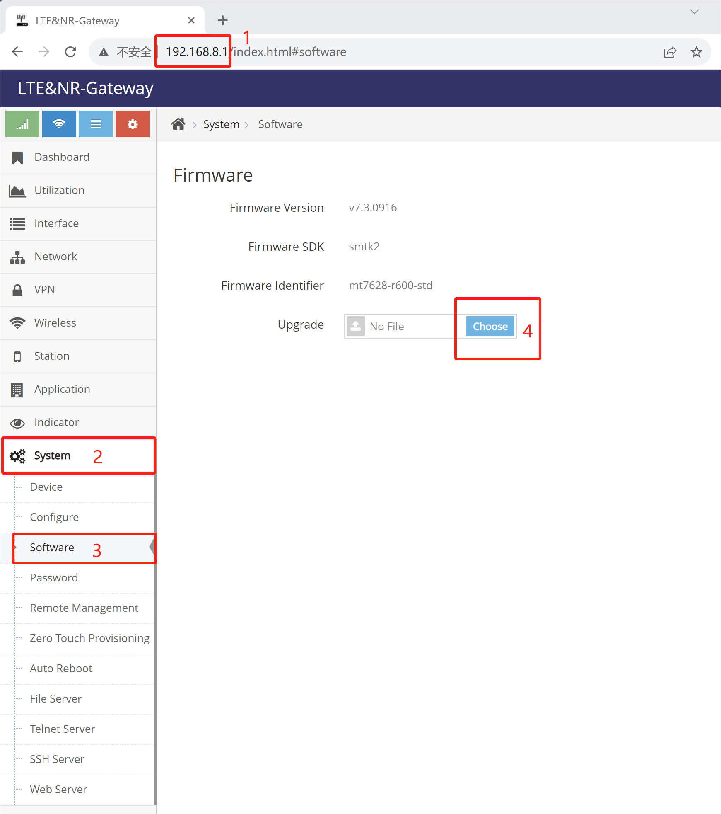
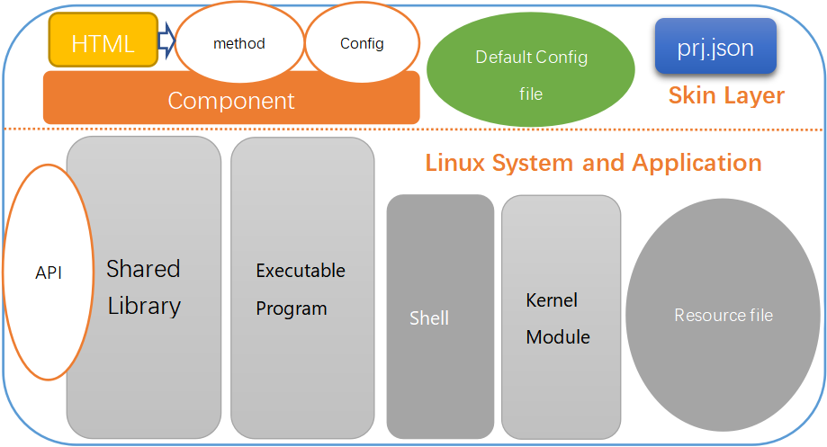

# SkinOS SDK download and compile

#### 1. Development environment download   
Under Ubuntu ( 20.04 or 18.04 recommended ) run the following command to download the development environment ( please install git and make first )

```shell
git clone https://gitee.com/tiger7/tiger7.git

```

*Or download it from gitee*

```shell
git clone https://github.com/skinos7/tiger7.git
```

#### 2. Install the necessary development tools  

```shell
cd tiger7
make ubuntu_preset
```
*This command will help to install some common development tools, that is, execute the following execution to install the development tools, if there is an installation error, please manually install according to the current Ubuntu environment*
```
sudo apt-get update
sudo apt-get install vim git subversion pandoc aptitude
sudo apt-get install gcc g++ binutils patch bzip2 flex bison make autoconf gettext texinfo unzip sharutils gawk
sudo apt-get install python2 libtool shtool curl lrzsz zlib1g-dev automake automake1.11
sudo apt-get install lib32z1 libssl-dev device-tree-compiler libevent-dev
sudo snap install ttyd --classic
sudo apt-get install lib32ncurses5
sudo apt-get install libncurses5-dev
sudo apt-get install libncursesw5-dev
```


#### 3. Specify the product model to be developed   

```shell
make pid gBOARDID=<Product complete model>

# For products such as D218 enter the following instructions:
make pid gBOARDID=mtk2-mt7628-d218

# For products such as 2218/3218/5218 enter the following instructions:
make pid gBOARDID=mtk2-mt7628-r600

# For products such as D228 enter the following instructions:
make pid gBOARDID=mtk2-mt7621-d228

# For products such as D228P enter the following instructions:
make pid gBOARDID=mtk2-mt7621-d228p
```
*If you do not know the product model, please consult the sales technical support*

#### 4. Download the SDK corresponding to the product model

```shell
make update
```

#### 5. Update the application menu   

```shell
make menu
make menuconfig
```  
***Note: Save and exit directly when show the menu***

#### 6. Compile gateway firmware 

```shell
make dep
make
```
After 2 to 5 hours, the gateway firmware upgrade package ending in **.zz** will be generated in the tiger7/build directory   


#### 7. Upgrade the firmware to the gateway

In the gateway web page management interface, **System => Software => Upgrade** Click the firmware that ending in **.zz** to upgrading   




# Introduction to the project architecture in SkinOS

Development in SkinOS is based on a project-based basis

- To develop an executable program, you first create a project, then create an executable template, and then write code based on the template
- To develop a component program, first create a project, then create a component program template, write code based on the template
- To develop a library, first create a project, then create a library template, and write code based on the template
- To develop the kernel module program, first create the project, then create the kernel module program template, write code based on the template
- To develop the web interface program, first create the project, then create the web interface program template, based on the template to write the Web page
- To develop a Shell script, first create a project and then create a Shell file directly in the project directory
- Add other files, first create the project, then put the files in the project directory, and specify them in the project configuration file

*By creating a project to develop, the SkinSDK compilation system will automatically compile, package into an installation package or install into the firmware. Developers do not need to care about the details of compilation, packaging and installation. Developers only need to tick the created project during compilation*

**The following is an introduction to the project structure**



**Skin Layer**, provide a unified management interface to the SkinOS or users   
- **Component** provide a unified management interface to the SkinOS or users
- **Default Configure file** provide default setting
- **HTML** provide management UI
- **prj.json** Describe all of the project's resources in JSON format

**Linux System and Application**, Traditional Linux applications, resource files, etc, Generally, no external interface is provided：
- **Executable program**
- **Kernel Module**
- **Shared Library**
- **shell** script file
- **Resource file** other file

SkinOS system components manage the project through **Skin Layer**


*Directories for projects in SkinOS are stored in the [tiger7/project](https://gitee.com/tiger7/tiger7/tree/master/project) directory*


**Introduction to project configuration files([prj.json](https://gitee.com/tiger7/doc/blob/master/dev/prj.json.md))** 

- A JSON format that describes all of the project's assets, automatically generated when the project is created

- Guide the compilation process at compiling

- Guide the installation process during installation

- The boot option is registered during SkinOS startup

- Register the shutdown item when the SkinOS shuts down

- Register event handlers to SkinOS

- Register the web menu(page) to SkinOS   


# Project development guidance

- **[Online Shell component development](https://gitee.com/tiger7/doc/blob/master/dev/online_development.md)**
Introduction and demonstration of writing Shell script components directly in the running system

- **[Project and component development](https://gitee.com/tiger7/doc/blob/master/dev/beginner_development.md)**
Introduce and demonstrate the SkinSDK **project** development steps, and show how to develop a feature by way of an example

- **[Port Openwrt project to SkinSDK - Easy version](https://gitee.com/tiger7/doc/blob/master/dev/porting_openwrt.md)**
Introduce and demonstrate porting open source projects under Openwrt to SkinSDK and running it on the boot

- **[Port Openwrt projects to SkinSDK - Advanced edition](https://gitee.com/tiger7/doc/blob/master/dev/porting_openwrt_adv.md)**
Porting open source projects under Openwrt to SkinSDK, and developing WEB management interface for it, allowing users to manage them through WEB/Command management


- [Write a Linux executable in the project](https://gitee.com/tiger7/doc/blob/master/dev/beginner_development.md)
Demonstrates the Linux executable developed in the SkinSDK **project**

- [Write a shared library in the project](https://gitee.com/tiger7/doc/blob/master/dev/beginner_development.md)
Demo Developing a shared dynamic library in the SkinSDK **project**

- [Write kernel modules in the project](https://gitee.com/tiger7/doc/blob/master/dev/beginner_development.md)
Demo developing kernel modules in SkinSDK **project**

- [Develop scripts in the project](https://gitee.com/tiger7/doc/blob/master/dev/beginner_development.md)
Demo scripting Shell in SkinSDK **project**

- [Add additional files to the project](https://gitee.com/tiger7/doc/blob/master/dev/beginner_development.md)
Demo Add some assets to the SkinSDK **project**

- [Porting Linux applications to SkinSDK - Easy version](https://gitee.com/tiger7/doc/blob/master/dev/beginner_development.md)
Introduce and demonstrate porting Linux programs to SkinSDK, and boot it up and running

- [Porting Linux applications to SkinSDK - Advanced edition](https://gitee.com/tiger7/doc/blob/master/dev/beginner_development.md)
This paper introduces and demonstrates the transplantation of Linux programs into SkinSDK, and develops a WEB management interface for it, allowing users to manage it through WEB management interface or command

- [Add LTE/NR module driver under the modemdrv project](https://gitee.com/tiger7/doc/blob/master/dev/beginner_development.md)
Introduce in how to add new LTE/NR module driver, let SkinSDK support more 4G or 5G module driver

- [Customize the network connection mode](https://gitee.com/tiger7/doc/blob/master/dev/beginner_development.md)
Introduction in the custom network connection strategy, to achieve more complex connection logic

- [Customize the default configuration](https://gitee.com/tiger7/doc/blob/master/dev/beginner_development.md)
Describes how to customize the default configuration of the product, allowing custom device to restore the original configuration after the factory

- [The event system of SkinOS](https://gitee.com/tiger7/doc/blob/master/dev/beginner_development.md)
The events of SkinOS are introduced, and actions are triggered by registering event events

- [SkinOS 'register variable system](https://gitee.com/tiger7/doc/blob/master/dev/beginner_development.md)
This paper introduces the implementation of simple interaction between components by using the register variable system, and saves information outside the life cycle of components

- [Calling component interfaces in programming](https://gitee.com/tiger7/doc/blob/master/dev/call_component.md)
Describes how to call the interface of other components in the program

- [Programmatically manage component configuration](https://gitee.com/tiger7/doc/blob/master/dev/component_config.md)
Describes how to manage the configuration of other components in the application


