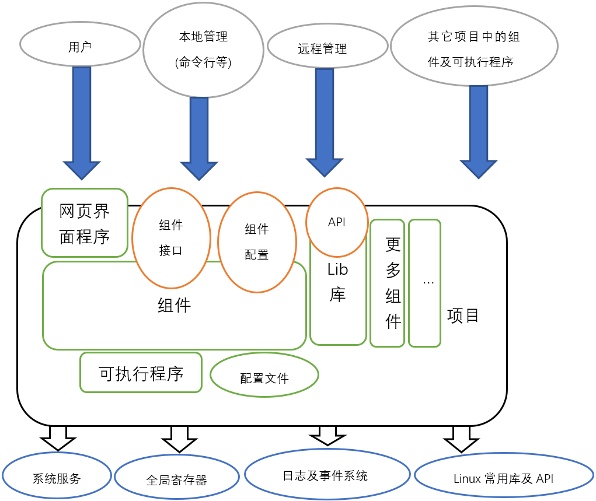

## 项目及组件开发

开发应用程序需要创建项目, 在项目下可以创建可执行程序及组件等组成部分
- 在系统中所有的功能都划规为一个个项目, 项目下又分为一个个组件, 项目中可以有多个组件
	- 组件通常为实际实现功能的逻辑部件
	- 也可以在执行程序中实现功能逻辑, 再以组件为执行程序提供接口与系统结合
- 项目在编译完之后会打包成为FPK安装包, FPK安装包安装到设备上时会形成项目目录

组件介绍
- 组件可向外提供配置(掉电保存)称之为**组件配置**, 也可向外提供**组件接口**
- 系统其它部件(其它组件/可执行程序等)根据需要可通过操作**组件配置**来对组件进行管理, 也可通过**组件接口**实现与组件实时通信来实现对组件的状态查询、启禁某些功能、传递实时信息等
- 组件中以下划线开头命名的函数为 **组件接口** , 使用 **scall/ccall** 系列函数指定 **项目名@组件名** 及 **组件接口** 可调用到这些以下划线开头命名的函数, 称之为 **调用组件接口**
- 组件以 **_get/_set** 函数为 **组件配置接口** . 使用 **sget/cget/sset/cset** 系列函数指定 **项目名@组件名** 可调用到组件的_get及_set函数, 称之为 **操作组件配置**
- 可向系统注册组件接口, 实现系统启动(系统关机/事件发生)时调用其组件接口
- 可将组件接口注册为服务项, 实现系统一直维持其运行, 类似Linux的守护进程
- 项目中可以开发多个网页界面程序, 通过界面可以直接 **调用组件接口** 及 **操作组件配置**, 让用户通过网页界面对组件的配置及管理
- 组件中可以调用Linux标准的C库及系统接口, 也可以调用其它第三方的共享库, 与开发Linux程序相同只需要添加对应的头文件及链接对应的库即可

## 项目及组件框图



## 在SDK中创建项目 
在编译环境顶层目录下执行: 
```shell
./tools/prj create 项目名
```
将提示输入项目简介, 输入项目简介后回车即可创建对应的项目

###### 示例: 输入./tools/prj create verify回车将提示您输入项目简介， 输入简介后回车创建verify项目
```shell
dimmalex@HMS:~/tiger7$ ./tools/prj create verify
project verify introduction: verify skinos program
dimmalex@HMS:~/tiger7$ 
```
执行后无任何提示表示成功
执行成功后在tiger7/project目录中多出一个verify的目录, 此目录即为项目目录, verify项目的所有文件都将会在此目录中
```shell
dimmalex@HMS:~/tiger7$ ls ./project/verify/
Makefile  prj.json
dimmalex@HMS:~/tiger7$ 
```
prj.json为项目配置文件, 对于其它更详细的介绍可见[项目管理组件](../com/land/prj.md)中有关prj.inf文件的介绍


## 项目内创建组件 
在编译环境顶层目录下执行: 
```shell
./tools/prj add_com 项目名 组件名
```
将提示输入组件简介, 输入组件简介后回车即可在项目内创建对应的组件
###### 示例: 输入./tools/prj add_com verify telecom4g 回车将提示您输入组件简介， 输入简介后回车将在verify项目下创建telecom4g组件
```shell
dimmalex@ubuntu18:~/mytry6$ ./tools/prj add_com verify telecom4g
component telecom4g introduction: Telecom 4G CPE register function
dimmalex@ubuntu18:~/mytry6$ 
```
执行后无任何提示表示成功
执行成功后对应的项目目录中多出一个telecom4g的目录, 此目录即为组件目录, 此组件目录下会生成两个文件:
- 一个是后缀为.c结尾的组件同名的C程序, 此文件即为组件的代码文件, 将在这个文件中添加具本的实现代码
- mconfig为编译标识修改文件, 在此文件中可以对编译的CFLAGS及LDCFLAGS做调整, 通常不用修改
```shell
dimmalex@ubuntu18:~/mytry6$ ls ./project/verify/telecom4g
mconfig  telecom4g.c
dimmalex@ubuntu18:~/mytry6$ 
```


## 组件开发介绍
开发组件需要创建项目, 创建项目后再创建组件, 组件中需要实现一些函数, 通过对组件中函数的运行状态将其归类为以下两种函数:  
- **一次性执行函数**  
	特点是执行后需要立即退出, 用于向系统注册为启动项, 关机项, 事件处理项 或 用于向外部提供接口供其它模块或网页等调用
	如: Telnet服务器组件中的_setup函数被注册为启动项, 开机会被运行, 此函数会将组件中的_service函数注册为服务项, 然后立即退出
- **后台服务函数**  
	特点是永久运行不退出的服务类函数, 用于向系统注册为服务项
	如: Telnet服务器组件中的_service函数一直运行, 并监听23端口, 为连入的telnet客户端提供服务

以上是组件函数的状态的分类, 通常一个组件中有以下几个常用的函数需要实现:
- **启动函数的编写**
	_setup函数, 为一次性执行函数(即执行后必须立即退出), 用于注册为开机项, 在系统 **开机启动** 时运行, 用于初始化组件
- **关机函数的编写**
	_shut函数, 为一次性执行函数(即执行后必须立即退出), 用于注册为关机项, 在 **系统关机** 时执行, 用于关闭组件
- **事件处理函数的编写**  
	_take函数及其它名称的事件处理函数, 为一次性执行函数(即执行后必须立即退出), 用于注册为事件处理项, 在系统发生指定 **事件发生** 时执行
- **后台服务函数的编写**  
	_service函数及其它名称的后台服务函数, 特点是永久运行不退出的服务类函数, 用于注册为服务项
- **组件配置管理函数的编写**  
	_get及_set函数, 为一次性执行函数(即执行后必须立即退出), 当组件需要向外提供组件配置时实现, 相当与组件配置的查看及设置的钩子函数, 在 **管理组件配置** 时被调用到
	- _set函数用于在其它用户或部件在设置组件配置时将参数写入项目配置中同时并应用于组件中
	- _get函数在其它用户或部件在查看组件配置时从项目配置中读入配置并跟据需要做调整


开发组件或可执行程序时可使用的资源及对应的接口:
- **操作项目配置**
	每个项目配置都是一个JSON对象, 存放到系统的存储器(掉电保存)
	每个项目配置都基于其所属的项目名加上@加上配置名称来命名, 如mytest@cfgop表示为mytest项目下的cfgop配置
	通过config_get/config_set等系列函数可以操作项目配置, 具体见 [操作项目配置](./项目及组件开发介绍-操作项目配置.md)
- **调用其它组件接口**
	组件接口是组件向外提供的功能接口, 允许其它的组件或程序调用
	每个组件都基于其所属的项目名加上@加上组件名称来命名, 如mytest@mycom表示为mytest项目下的mycom组件
	通过com_call等系列函数可以调用组件接口, 具体见 [调用组件接口](./项目及组件开发介绍-调用组件接口.md)
- **管理其它组件配置**
	组件配置也是组件向外提供的配置, 允许其它的组件或程序操作配置
	通过com_get/com_set等系列函数可以管理组件配置, 具体见 [管理组件配置](./项目及组件开发介绍-管理组件配置.md)
- **操作系统服务**
	系统中存在一些一直运行的函数, 称之为系统服务, 可以将组件的后台服务函数注册为系统服务使其保持一直运行
	通过serv_开头的系统服务类函数来注册注销系统服务, 具体更多介绍见 [操作系统服务](./项目及组件开发介绍-操作系统服务.md)
- **运行可执行程序**
	通过project_bin_path()函数来获取项目的可执行程序的路径
	通过shell(), system()等来运行可执行程序
- **操作全局寄存器**
	全局寄存器用于存放所有程序可以实时操作交互的变量, 相当于Linux的内存共享
	通过reg_get/reg_set等系统函数可以读写全局寄存器, 具体更多介绍见 [操作全局寄存器](./项目及组件开发介绍-操作全局寄存器.md)
- **记录日志**
	通过debug/info/warn/fault等系统函数实现向日志系统记录日志, 具体更多介绍见
- **记录事件**
	通过land@event组件的trigger接口记录事件信息, 具体更多介绍见 [操作系统日志](./项目及组件开发介绍-操作系统日志.md)
- **获取项目信息**
	通过如project_path()函数来获取项目所在的位置, 具体更多介绍见 [获取项目信息](./项目及组件开发介绍-获取项目信息.md)

------

**以下开发一个电信自注册功能的程序来演示如何开发一个完整的项目(即verify项目), 使用telecom4g组件来实现电信自注册逻辑, 为其提供默认的配置, 并开发一个状态查询及启用禁用此功能的配置界面供用户管理**

上图清楚的给出了项目中telecom4g组件的结构及与项目其它部件及系统之间的关系, 下面我们将一步步完成图中所有函数及部件编写

## 创建项目 
在编译环境顶层目录下执行: 
```shell
./tools/prj create 项目名
```
将提示输入项目简介, 输入项目简介后回车即可创建对应的项目

###### 示例: 输入./tools/prj create verify回车将提示您输入项目简介， 输入简介后回车创建verify项目
```shell
dimmalex@ubuntu18:~/mytry6$ ./tools/prj create verify
project verify introduction: Multiple verify program             
dimmalex@ubuntu18:~/mytry6$ 
```
执行后无任何提示表示成功
执行成功后在./project目录中多出一个verify的目录, 此目录即为项目目录, verify项目的所有文件都将会在此目录中
```shell
dimmalex@ubuntu18:~/mytry6$ ls ./project/verify/
Makefile  prj.json
dimmalex@ubuntu18:~/mytry6$
```
其实prj.json为项目配置文件, 对于其它更详细的介绍可见[项目管理组件](../com/land/prj.md)中有关prj.inf文件的介绍


## 项目内创建组件 
在编译环境顶层目录下执行: 
```shell
./tools/prj add_com 项目名 组件名
```
将提示输入组件简介, 输入组件简介后回车即可在项目内创建对应的组件
###### 示例: 输入./tools/prj add_com verify telecom4g 回车将提示您输入组件简介， 输入简介后回车将在verify项目下创建telecom4g组件
```shell
dimmalex@ubuntu18:~/mytry6$ ./tools/prj add_com verify telecom4g
component telecom4g introduction: Telecom 4G CPE register function
dimmalex@ubuntu18:~/mytry6$ 
```
执行后无任何提示表示成功
执行成功后对应的项目目录中多出一个telecom4g的目录, 此目录即为组件目录, 此组件目录下会生成两个文件:
- 一个是后缀为.c结尾的组件同名的C程序, 此文件即为组件的代码文件, 将在这个文件中添加具本的实现代码
- mconfig为编译标识修改文件, 在此文件中可以对编译的CFLAGS及LDCFLAGS做调整, 通常不用修改
```shell
dimmalex@ubuntu18:~/mytry6$ ls ./project/verify/telecom4g
mconfig  telecom4g.c
dimmalex@ubuntu18:~/mytry6$ 
```


## 编写组件代码实现功能

#### 1. 使用vi打开组件代码文件 
```shell
dimmalex@ubuntu18:~/mytry6$ vi ./project/verify/telecom4g/telecom4g.c 
```

#### 2. 原有组件模板 
1. 创建组件时自动生成的模板, 此模板可能会不定期更新并增加新的信息, 但大至框架不会变化
2. 通常组件模板包括了8个接口:

```c
const char *_intro( obj_t this );               // 为一次性执行函数, 返回一个组件说明的字符串, 用于说明所有接口的用法, 原则上要求返回的是一个JSON格式的接口列表说明
talk_t _setup( obj_t this, param_t param );     // 为一次性执行函数, 此函数约定用于启动组件时调用, 会被注册为启动项, 类似于初始化组件的功能函数
talk_t _shut( obj_t this, param_t param );      // 为一次性执行函数, 此函数约定用于关闭组件时调用, 会被注册为关机项, 类似于关闭组件的功能函数
talk_t _service( obj_t this, param_t param );   // 为后台服务函数, 此函数约定用于一直运行的服务函数, 为实现实际的功能, 用于向系统服务注册的服务, 不能直接调用, 类似于Linux中的守护进程, 这个函数会在_setup函数运行时注册为服务项
talk_t _take( obj_t this, param_t param );      // 为一次性执行函数, 此函数约定用于处理事件的函数, 当此组件需要跟据某此事件做出处理时可实现此函数
talk_t _get( obj_t this, path_t path );         // 为一次性执行函数, 此函数用于获到组件的配置, 在用户或其它程序获到组件配置时此函数会被调用
boole _set( obj_t this, path_t path, talk_t v );// 为一次性执行函数, 此函数用于设置组件的配置, 在用户或其它程序设置组件配置时会被调用
```

3. 以上函数参数介绍:

```c
obj_t this  ------ 为组件名称的结构化的表示, 用于表示当前组件名称
param_t param ---- 为参数的结构化的表示, 用于表示调用当前接口时的传参信息
path_t path  ----- 为属性路径的结构化的表示, 用于表示_get查询/_set设置指定的属性路径
talk_t v  -------- 为值的结构化的表示, 用于表示_set设置的值
```

***以上函数都将运行于不同的进程中, 所以函数间不能直接交换数据***

#### 3. 编辑组件函数 
以下示例我们通过编辑组件的代码来实现 **中国电信的自注册功能** , 此功能的需求在verify项目的doc文件目录下
1. 编写_intro函数
对于此组件我们只提供除setup及shut接口之外的一个status接口, 用于查看自注册的状态, 因此将在_intro返回的信息中加入status接口的说明, 我们将_intro函数修改如下:

```c
const char *_intro( obj_t this )
{
    const char *helpstr = \
"{"\
"\n    \"setup\":\"setup the telecom 4G CPE verify function\","\
"\n    \"shut\":\"shutdown the telecom 4G CPE verify function\","\
"\n    \"status\":\"get the telecom 4G CPE verify status\""\
"\n}\n";
    return helpstr;
}
```

2. 编写_setup函数, 即setup接口
对于模板的_setup函数即满足我们的要求, 即获取组件配置并跟据配置的status参数决定是否把本组件的_service函数(即service接口)注册为系统服务, 因此我们不用修改_setup函数

```c
talk_t _setup( obj_t this, param_t param )
{
	// 默认根据组件配置的status属性来决定是否启动_service服务函数
	talk_t cfg;
	const char *ptr;

	/* 获取组件配置 */
	cfg = config_get( this, NULL );
	/* 得到组件配置的status属性值 */
	ptr = json_get_string( cfg, "status" );
	/* 判断值是否为enable */
	if ( ptr != NULL && 0 == strcmp( ptr, "enable") )
	{
		/* 将本组件的_service函数以服务的形式运行. 服务名为COM_IDPATH即当前的组件名称verify@telecom4g */
		serv_start( this, "service", NULL, COM_IDPATH );
	}

	/* 释放组件配置 */
	talk_free( cfg );
	/* 退出, 记住一定要运行后立即退出, 如果不退出可能导致整个系统启动卡死在这里 */
    return ttrue;
}
```

3. 编写_shut函数, 即shut接口
对于模板的_shut函数同样满足我们的要求, 即在关闭组件时停止我们在_setup函数中注册的系统服务

```c
talk_t _shut( obj_t this, param_t param )
{
	/* 停止服务 */
	serv_stop( COM_IDPATH );
	/* 退出, 记住一定要运行后立即退出, 如果不退出可能导致整个系统启动卡死在这里 */
	return ttrue;
}
```

4. 编写_service函数, 即service接口
我们要在_service函数中实现整个自注册的逻辑, 因此我们需要清空_service函数来重新编写
- 在重新编_service之前我们写一个发起注册的函数:

```c
/* 包含此头文件可调用easy_rtalk_type发起POST请求 */
#include "remotetalk/remotetalk.h"
/* 发起注册 */
boole telecom_cpe_register( const char *remote, const char *encrypt, talk_t lte )
{
	talk_t v;
	talk_t ack;
	const char *ptr;
	char buffer[IDENTIFY_SIZE];

	/* 创建注册包 */
	v = json_create();

	#if 0
	json_set_string( v, "REGVER", "8.0" );
	json_set_string( v, "UETYPE", "23" );
	json_set_string( v, "MODEL", "ZYY-ES M9" );
	json_set_string( v, "OSVER", "FarmOS6.0" );
	json_set_string( v, "ROM", "8M" );
	json_set_string( v, "RAM", "64M" );
	json_set_string( v, "SWVER", " 4.3.3n" );
	json_set_string( v, "MACID", "4C:BC:98:01:06:98" );
	json_set_string( v, "IMEI1", "863078036821124" );
	json_set_string( v, "SIM1ICCID", "89861120147330291660" );
	json_set_string( v, "SIM1CDMAIMSI", "460115372165490" );
	json_set_string( v, "SIM1CELLID", "219769344" );
	#else
	talk_t machine_status;
	json_set_string( v, "REGVER", "8.0" );
	json_set_string( v, "UETYPE", "23" );
	json_set_string( v, "MODEL", "ZYY-ES M9" );
	json_set_string( v, "OSVER", "FarmOS6.0" );
	json_set_string( v, "ROM", "8M" );
	json_set_string( v, "RAM", "64M" );
	/* 设备信息 */
	machine_status = com_scall( MACHINE_COM, "status", NULL );
	ptr = json_get_string( machine_status, "version" );
	json_set_string( v, "SWVER", ptr );
	ptr = json_get_string( machine_status, "mac" );
	json_set_string( v, "MACID", ptr );
	talk_free( machine_status );
	/* LTE1 */
	ptr = json_get_string( lte, "imei" );
	json_set_string( v, "IMEI1", ptr );
	ptr = json_get_string( lte, "iccid" );
	json_set_string( v, "SIM1ICCID", ptr );
	ptr = json_get_string( lte, "imsi" );
	json_set_string( v, "SIM1LTEIMSI", ptr );
	ptr = json_get_string( lte, "cell" );
	json_set_string( v, "SIM1CELLID", ptr );
	#endif
	/* 时间  */
    if ( system( "date '+%Y-%m-%d %H:%M:%S'>/tmp/.verify_telecom4g_regdate 2>/dev/null" ) == 0 )
    {
        ptr = read_string( "/tmp/.verify_telecom4g_regdate", buffer, sizeof(buffer) );
        if ( ptr != NULL && *ptr != '\0' )
        {
            buffer[ strlen(buffer)-1 ] = '\0';
			json_set_string( v, "REGDATE", buffer );
        }
    }

	/* 使用remotetalk库中的函数发起POST请求, 因此注意在组件的mconfig文件中加入remotetalk的链接, 并且也要加入curl库的链接(因为remotetalk用到了curl库) */
	ack = easy_rtalk_type( remote, "Content-Type:application/encrypted-json", encrypt, v, 30, 30, PROJECT_TMP_DIR"/.verify_telecom4g_cookie" );
	if ( ack == tfalse )
	{
		talk_free( v );
		return false;
	}
	talk_free( v );
	/* 确认注册是否成功 */
	ptr = json_get_string( ack, "resultCode" );
	if ( ptr == NULL || 0 != strcmp( ptr, "0" ) )
	{
		return false;
	}

	return true;
}
```

- 在_service函数中实现注册的逻辑, 此函数为后台服务函数, 不允许随意退出(**因为如果非正常退出系统会自动再次运行**):

```c
talk_t _service( obj_t this, param_t param )
{
	int f;
	boole r;
	talk_t ret;
	talk_t cfg;
	talk_t ifnamest;
	const char *object;
	const char *ifname;
	const char *remote;
	const char *encrypt;
	const char *cur_iccid;
	const char *save_iccid;

	object = obj_string( this );
	/* 查看是否存在默认路由来确定数据业务是否可用 */
	if ( route_exist( "0.0.0.0", NULL, NULL, NULL ) == false )
	{
		/* 如数据业务不可用, 休眠10秒后退出, 退出后系统会重新运行此函数 */
		sleep( 10 );
		return tfalse;
	}
	/* 获取组件所有配置 */
	cfg = config_get( this, NULL );
	save_iccid = json_get_string( cfg, "iccid" );
	/* 获取 读哪一个LTE模块 的信息, 如无配置则默认为第一个LTE模块 */
	ifname = json_get_string( cfg, "lte" );
	if ( ifname == NULL || *ifname == '\0' )
	{
		ifname = LTE_COM;
	}
	/* 调用LTE模块的status接口来获取它的ICCID */
	ifnamest = com_scall( ifname, "status", NULL );
	cur_iccid = json_get_string( ifnamest, "iccid" );
	if ( cur_iccid == NULL || *cur_iccid == '\0' )
	{
		/* 如获到不到LTE的ICCID, 休眠10秒后退出, 退出后系统会重新运行此函数 */
		talk_free( ifnamest );
		sleep( 10 );
		return tfalse;
	}
	if ( save_iccid != NULL && 0 == strcmp( save_iccid, cur_iccid ) )
	{
		/* 不满足上报自注册信息触发条件,      注销系统服务并退出*/
		serv_off( COM_IDPATH );
		return tfalse;
	}

	ret = tfalse;
	/* 发起注册 */
	remote = json_get_string( cfg, "remote" );
	encrypt = json_get_string( cfg, "encrypt" );
	r = telecom_cpe_register( remote, encrypt, ifnamest );
	if ( r == false )
	{
		/* 注册失败次数加一 */
		count_plus( object, "regfailed" );
		/* 如果注册失败次数超过10次结束本次开机注册 */
		f = count_get( object, "regfailed" );
		if ( f >= 10 )
		{
			serv_off( COM_IDPATH );
		}
		else
		{
			/* 等待一个小时后再发起注册 */
			sleep( 3600 );
		}
	}
	else
	{
		/* 注册成功后记录iccid, 并结束 */
		ret = ttrue;
		config_ssets( object, "iccid", cur_iccid );
		serv_off( COM_IDPATH );
	}
	talk_free( ifnamest );
	return ret;
}
```

5. 编写_status函数, 即status接口
我们要在_status函数中返回当前注册组件的状态, 比如是否已注册过, 注册用的ICCID是多少等信息

```c
talk_t _status( obj_t this, param_t param )
{
	int f;
	talk_t v;
	talk_t cfg;
	const char *ptr;

	v = json_create();
	cfg = config_get( this, NULL );
	/* 如果在组件配置中发现有iccid的信息即表示已注册过 */
	ptr = json_get_string( cfg, "iccid" );
	if ( ptr != NULL && *ptr != '\0' )
	{
		json_set_string( v, "status", "registered" );
		json_set_string( v, "iccid", ptr );
	}
	else
	{
		json_set_string( v, "status", "unregistered" );
		f = count_get( obj_string(this), "regfailed" );
		json_set_number( v, "failed", f );
	}
    return v;
}
```

6. 编写_take函数, 即take接口
我们要在_take函数处理上线事件, 当设备一上线我们将立即启动注册服务或重启注册服务, 然后服务会立即检测到已上线而立即发起注册

```c
talk_t _take( obj_t this, param_t param )
{
	const char *event;

	/* 得到事件名称 */
	event = param_option( param, 1 );
	/* 如果事件名称为network/online(即外网连接上线)则立即重启组件的服务 */
	if ( event != NULL && 0 == strcmp( event, "network/online" ) )
	{
		serv_reset( COM_IDPATH );
	}

    return tfalse;
}
```

7. 编写_get函数, 即获取组件配置时实际调用的函数
这个函数就是实际的调用配置获到的函数, 并返回这个函数的返回, 模板中的代码即可满足这个需求, 所以我们不需要修改

```c
talk_t _get( obj_t this, path_t path )
{
    talk_t cfg;

    /* 获取到的组件的配置参数返回给调用者 */
    cfg = config_get( this, path );

    return cfg;
}
```

8. 编写_set函数, 即修改组件配置会实际调用的函数
这个函数就是实际的去修改配置参数, 在修改成功后重启这个组件, 模板中现有的代码就满足这个需求, 所以我们不需要修改

```c
boole _set( obj_t this, path_t path, talk_t v )
{
    boole ret;

    /* 直接将设置的参数存入组件配置中 */
    ret = config_set( this, path, v );
    /* 如存入成功将调用通过先调用_shut关闭后再调用_setup来重启对应的服务 */
    if ( ret == true )
    {
    	/* 成功存入后重启组件 */
        _shut( this, NULL );
        _setup( this, NULL );
    }
    return ret;
}
```

#### 4. 注册开机启动
在以上的_setup函数(setup接口)中我们实现了启动组件的代码, 但我们还需要在系统启动时自动调用_setup函数, 以实现自启动, 因此需要使用如下命令实现注册开机运行_setup函数(setup接口)

```shell
dimmalex@ubuntu18:~/mytry6$ ./tools/prj add_init verify general verify@telecom4g.setup     
dimmalex@ubuntu18:~/mytry6$ 
```

此指令无任何报错即表示成功注册, 成功注册后我们在verify的prj.json文件中也可以看到对应的注册项

```shell
dimmalex@ubuntu18:~/mytry6$ cat project/verify/prj.json 
{
    "name":"verify",
    "version":"internal",
    "author":"fpk.preset",
    "intro":"Multiple verify program",
    "com":
    {
        "telecom4g":"Telecom 4G CPE register function"
    },
    "init":
    {
        "general":"verify@telecom4g.setup"         // 注册的启动级别: 需要运行的组件接口
    }
}
```

#### 5. 注册关机执行 
在以上的_shut函数(shut接口)中我们实现了关闭组件的代码, 但我们还需要在系统关机时自动调用_shut函数, 以实现关机自动关闭当前组件, 因此需要使用如下命令实现注册关机执行_shut函数(shut接口)

```shell
dimmalex@ubuntu18:~/mytry6$ ./tools/prj add_uninit verify general verify@telecom4g.shut    
dimmalex@ubuntu18:~/mytry6$ 
```

此指令无任何报错即表示成功注册, 成功注册后我们在verify的prj.json文件中也可以看到对应的注册项

```shell
dimmalex@ubuntu18:~/mytry6$ cat project/verify/prj.json 
{
    "name":"verify",
    "version":"internal",
    "author":"fpk.preset",
    "intro":"Multiple verify program",
    "com":
    {
        "telecom4g":"Telecom 4G CPE register function"
    },
    "init":
    {
        "general":"verify@telecom4g.setup"
    },
    "uninit":
    {
        "general":"verify@telecom4g.shut"    // 注册的关机级别: 需要运行的组件接口
    }
}
```

#### 6. 注册事件处理 
在上面的_take函数中我们处理了当接口上线(network/online)事件时需要做的工作, 我们还需要向系统注册这个事件处理, 以便在发生事件时系统会调用到这个_take函数

```shell
dimmalex@ubuntu18:~/mytry6$ ./tools/prj add_joint verify network/online verify@telecom4g.take
dimmalex@ubuntu18:~/mytry6$ 
```

此指令无任何报错即表示成功注册, 成功注册后我们在verify的prj.json文件中也可以看到对应的注册项

```shell
dimmalex@ubuntu18:~/mytry6$ cat project/verify/prj.json 
{
    "name":"verify",
    "version":"internal",
    "author":"fpk.preset",
    "intro":"Multiple verify program",
    "com":
    {
        "telecom4g":"Telecom 4G CPE register function"
    },
    "init":
    {
        "general":"verify@telecom4g.setup"
    },
    "uninit":
    {
        "general":"verify@telecom4g.shut"
    },
    "joint":
    {
        "network/online":"verify@telecom4g.take"    // 注册的事件名称: 需要运行的组件接口
    }
```

#### 7. 修改mconfig加入引用了其它的库的支持 
因调用了remotetalk的库, 而remotetalk的库依赖于libcurl, 因此要加入这两个库的链接支持

```shell
dimmalex@ubuntu18:~/mytry6$ cat project/verify/telecom4g/mconfig 

CFLAGS += -I../
LDFLAGS += -lremotetalk -lcurl

dimmalex@ubuntu18:~/mytry6$ 
```


## 提供默认的项目配置 
在项目目录下会有组件名同名开头.cfg结尾的配置文件, 此项目配置文件为组件名同名的组件配置, 此配置文件必须为标准的JSON格式(且不支持数字/布尔/数组及注解)
此配置文件为项目配置, 也称之为同名组件的默认配置, 即设备恢复出厂后的同名组件配置即是该配置文件的内容
我们将在此文件中给也组件默认的配置

```shell
dimmalex@ubuntu18:~/mytry6$ cat project/verify/telecom4g.cfg 
{
    "status":"enable",
    "remote":"http://register.vnet.cn:999",
    "encrypt":"base64"
}
```

根据以上的组件配置即表示如下:
- 默认启动该组件 --- "status":"enable"
- 自注册的服务器地址为http://register.vnet.cn:999 --- "remote":"http://register.vnet.cn:999"
- 使用base64加密 --- "encrypt":"base64"

项目配置可以通过config_get/config_set函数来读写, 在以上telecom4g组件示例中: 
- 组件配置管理中的查询接口(_get)的实现即是通过config_get对应的项目配置来完成的
- 组件配置管理中的设置接口(_get)的实现则是通过config_set对应的项目配置来完成的


## 编写网页界面程序

#### 1. 为项目创建网页界面 
在顶层目录下执行

```shell
./tools/prj add_wui <项目名> <界面ID>
```

将提示输入界面的中英文菜单名, 输入后回车即可在项目内创建对应的界面

###### 示例: 输入./tools/prj add_wui verify telecom4g 回车将提示您输入中英文菜单名， 输入后回车将在verify项目下创建telecom4g的界面

```shell
dimmalex@ubuntu18:~/mytry6$ ./tools/prj add_wui verify telecom4g
web menu title(Chinese): testc设置
web menu name(English): testc Settings  
{
    "page":"testc.html",
    "lang":
    {
        "cn":"testc-cn.json",
        "en":"testc-en.json"
    },
    "cn":"testc设置",
    "en":"testc Settings"
}
dimmalex@ubuntu18:~/mytry6$ 
```

执行后会交互式的询问菜单的中英文名称（在管理网页中的应用菜单下显示的入口名）, 输入后会在verify的项目目录下产生三个文件：
- telecom4g.html   界面文件
- telecom4g-cn.json 中文语言文件
- telecom4g-en.json 英文语言文件
*注：使用中文名称或中文语言时系统一定要设为UTF8的编码, 否则将无法工作*

#### 2. 组件HTML界面开发 
修改对应的html界面即可, 接以上示例所生成的telecom4g.html中是一个简单的示例， 包含了获取及设置verify@telecom4g组件配置
修改网页需要有javascript、html的基本知识，并稍了解jquery的用法即可，具体的界面开发后面会写专门的文档来说明

#### 3. 获取组件配置
在html界面中通过 **he.load[ 组件名 ]** 获取组件配置, 并在then后给出获取到组件配置后的初始化函数, 组件名为一个字符串

```javascript
    // 从系统获取组件配置并填入界面中
    function load_comcfg()
    {
        // 从系统获取组件配置的调用
        he.load( [ comname ] ).then( function(v){                     //  comname为组件名, 是一个字符串, 如在telecom4g的示例中被定义为verify@telecom4g
            // 将获取到的配置赋值给存放组件配置的变量
            comcfg = v[0];
            if ( !comcfg )
            {
                comcfg = {};
            }
            // 将组件配置状态填入状态选项
            $('#status').prop( 'checked', able2boole(comcfg.status) );
            // 将组件配置属性值填入属性输入框中
            $('#property').val( comcfg.property );
            // 为状态选项绑定函数处理, 实现点选时界面隐藏或显示属性输入框
            $('#status').unbind('change').change(function () {
                // 如果选中
                if ($(this).prop('checked'))
                {
                    // 显示
                    $('#statusSets').show();
                }
                // 否则
                else
                {
                    //隐藏
                    $('#statusSets').hide();
                }
            }).trigger('change');
        });
    }

```

#### 4. 设置组件配置
在html界面中通过**he.save( [ 组件名+"="+JSON.stringify(组件配置) ] )**, 组件名为一个字符串, 组件配置为一个JSON对象

```javascript
    // 从界面得到修改的配置后保存并应用到组件配置中
    function save_comcfg()
    {
        if ( !comcfg )
        {
            comcfg = {};
        }
        // 拷贝一份组件配置
        var comcfgcopy = JSON.parse(JSON.stringify(comcfg));
        // 从状态选项中得到组件状态
        comcfg.status = boole2able( $('#status').prop('checked') );
        if ( comcfg.status == "enable" )
        {
            // 从属性输入框中得到组件属性值
            comcfg.property = $('#property').val();
        }
        // 比较拷贝确定组件配置是否有被修改
        if ( ocompare( comcfg, comcfgcopy ) )
        {
            // 如果未修改提示没有修改不需要应用
            page.alert( { message: $.i18n('Settings unchanged') } );
            return;
        }
        // 向系统保存并应用组件配置的调用
        he.save( [ comname+"="+JSON.stringify(comcfg) ] ).then( function(){     // comname为组件名, 是一个字符串, 如在telecom4g的示例中被定义为verify@telecom4g； comcfg为JSON对象, 保存有组件完整的配置
            // 提示应用成功
            page.hint2succeed( $.i18n('Modify successfully') );
            // 刷新界面内容
            load_comcfg();
        });
    }
```

#### 5. 调用组件接口查看状态
在html界面中通过**he.bkload( [ 组件名+".status" ] )** 来调用组件名的status接口, 从而可以获取到组件的状态, 当然也可以调用其它的组件接口

```javascript
	function flash_status( )
	{
		/* 以静默的方式在后台获取组件的status接口的返回 */
		he.bkload( [ comname+'.status' ] ).then( function(v){
			comstatus = v[0];                                 // comstatus即为组件的status接口的返回
		});
	}
```

#### 6. 多语言界面支持
多语言的支持主要是通过jquery的$.i18n()来实现

```javascript
    // 得到语言文件转化为JSON对象, 自动跟据系统语言类型变化路径(在prj.json中指名)
    var langjson = base64.decode( page.param( 'lang', location.hash ) );
    // 通过jquery的$.i18n()加载语言文件
    $.i18n().load( page.lang(langjson) ).then( function () {
        // 界面语言初始化
        $.i18n().locale = window.lang; $('body').i18n();
        // 加载组件配置
        load_comcfg();
        /* 绑定刷新按键 */
        $('#refresh').on(ace.click_event, function () {
            location.reload();
        });
        /* 绑定应用按键 */
        $('#apply').on(ace.click_event, function () {
            // 点应用时保存并应用组件配置
            save_comcfg();
        });
    });
```


## 刷新项目菜单 
执行make menu刷新菜单

```shell
dimmalex@ubuntu18:~/mytry6$ make menu
```


## 勾选项目 
执行make menuconfig后在 ***Farm system*** 下可以看到对应的 ***verify项目***, 勾选即可

```shell
dimmalex@ubuntu18:~/mytry6$ make menuconfig
```


## 编译项目 
可单独编译verify项目, 也可以要求编译整个固件(将会把verify的项目编译并打包到固件中)
- 单独编译verify项目
	```shell
	dimmalex@ubuntu18:~/mytry6$ make kernel OBJ=package/verify/compile
	```
	单独编译verify项目将会在./build/store目录下生成以项目名开头的fpk软件包
	```shell
	dimmalex@ubuntu18:~/mytry6$ ls build/store/verify*fpk
	build/verify-internal-mt7628.fpk
	dimmalex@ubuntu18:~/mytry6$ 
	```
	此fpk软件包可直接通过网页升级的方式安装到设备上去

- 编译整个固件
	```shell
	dimmalex@ubuntu18:~/mytry6$ make
	```
	将会在./build目录下生成zz后缀的固件升级包
	```shell
	dimmalex@ubuntu18:~/mytry6$ ls build/*.zz
	build/mt7628_r103_std_4.3.3n.zz
	dimmalex@ubuntu18:~/mytry6$ 
	```
	此zz后缀的固件升级包可直接通过网页升级到设备上去

***在编译过程中一定要注意报错信息, 当有出错时将不会生成fpk软件包***


## 升级到设备上 
通过在设备网页的 ***系统*** 菜单下的 ***软件管理*** 界面中升级对应的 ***fpk软件包*** 或升级整个 ***固件*** 即可


## 调试组件

#### 1. 命令行调试组件接口
通过HE终端可以直接调用的到组件的接口, HE终端相关的格式及命令介绍见[终端HE指令使用说明](../com/tui/he_command.md)
-  示例: 获取组件_intro函数返回的帮助信息

	```shell
	# verify@telecom4g.
	{
		"setup":"setup the telecom 4G CPE verify function",
		"shut":"shutdown the telecom 4G CPE verify function",
		"status":"get the telecom 4G CPE verify status"
	}
	#
	```

- 示例: 调用组件_setup函数的接口

	```shell
	# verify@telecom4g.setup
	#
	```

- 示例: 查看组件配置

	```shell
	# verify@telecom4g
	{
		"status":"enable",
		"remote":"http://register.vnet.cn:999",
		"encrypt":"base64"
	}
	#
	```

- 示例: 修改组件配置

	```shell
	# verify@telecom4g:status=disable
	#
	```

#### 2. 命令行调试组件的服务类接口
- 示例: 查看verify@telecom4g中_setup函数注册的服务是否有运行, 更多有关服务管理的接口见[服务管理组件](../com/land/service.md)

	```shell
	# service.info[ verify@telecom4g ]
	{
		"status":"live",                    // live表示已运行
		"pid":"1572",
		"obj":"verify@telecom4g",
		"op":"service",
		"ontime":"31",
		"cktime":"0",
		"livetime":"18:58:41:2"
	}
	#
	```

#### 3 . 组件使用日志调试

- 示例: 显示当前日志, 即可以当前日志中查询是否有verify@telecom4g组件打印的日志, 更多有关日志管理的接口见[日志管理组件](../com/land/syslog.md)

	```shell
	# log.show
	Dec 30 13:24:37 V520-12CC70 user.warn syslog: modem@lte check simcard failed 3 times
	Dec 30 13:24:38 V520-12CC70 user.warn syslog: modem@lte check simcard failed 4 times
	Dec 30 13:24:39 V520-12CC70 user.warn syslog: modem@lte check simcard failed 5 times
	Dec 30 13:24:40 V520-12CC70 user.warn syslog: modem@lte check simcard failed 6 times
	Dec 30 13:24:40 V520-12CC70 user.info syslog: search the modem device(modem@lte2)
	// 更多日志信息
	#
	`

