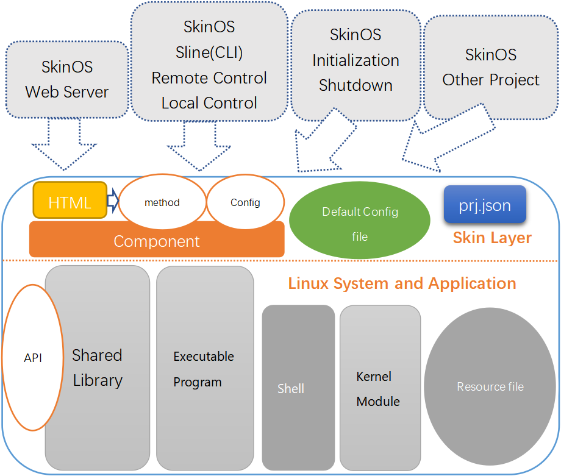

# SkinOS系统架构

- SkinOS中通过 **组件** 对Linux的可管理对象封装，向上层提供调用接口
- 在SkinOS中可管理的对象都是一个个 **组件**
- 多个相关或相类功能的组件组成一个项目   


# SkinOS项目介绍  

- SkinOS中的应用程序是 **项目**
- **项目** 在SDK中有对应的目录，目录中存放项目相关的源代码及各种资源文件
- **项目** 对应的目录都存放在都在 **[tiger7/project](https://gitee.com/tiger7/tiger7/tree/master/project)** 目录下
- **项目** 编译后会生成 **FPK安装包**, 用于安装到SkinOS中
- 以下是 **项目** 结构   


**[prj.json](https://gitee.com/tiger7/doc/blob/master/dev/prj.json.md)** 以JSON格式描述项目所有的资源
- 编译时指导编译过程
- 安装时指导安装过程
- 系统启动时注册启动项
- 系统关机时注册关机项
- 向系统注册事件处理项
- 向系统注册网页界面

**Component** 向系统或用户提供统一的管理接口
**Default Configure** 默认配置
**HTML** 菜单对应的界面文件
**Shell** shell脚本文件
**Open Source Program** 开源应用程序
**Linux Executable Program** 可执行程序
**Shared Library** 共享库
**Kernel Module** 内核模块


# SkinOS项目架构


**Skin Layer**, 向系统或用户提供统一的接口   
- **Component** 向系统或用户提供统一的接口
- **Default Configure file** 提供默认配置
- **HTML** 提供WEB管理界面
- **prj.json** 以JSON格式描述项目所有的资源

**Linux System and Application**, 传统的Linux程序,资源文件等等, 通常不外提供接口：
- **Executable program** 可执行程主邓
- **Kernel Module** 内核模块
- **Shared Library** 共享库
- **shell** 脚本
- **Resource file** 资源文件

SkinOS的系统组件通过**Skin Layer**对项目的管理




# SkinOS组件接口

#### 常用的组件API   
下图介绍网关常用的项目及组件API


**land** 项目, SkinOS核心项目, 管理网关的基本信息   
- machine 组件, 命名为 **land@machine**, 别名为 **machine**, **[设备基本信息管理](https://gitee.com/tiger7/doc/blob/master/com/land/machine.md)**   
- service 组件, 命名为 **land@service**, 别名为 **service**, **[系统服务管理](https://gitee.com/tiger7/doc/blob/master/com/land/service.md)**   
- auth 组件, 命名为 **land@auth**, 别名为 **auth**, **[用户名密码及权限管理](https://gitee.com/tiger7/doc/blob/master/com/land/auth.md)**   
- syslog 组件, 命名为 **land@syslog**,  **log**, **[日志管理](https://gitee.com/tiger7/doc/blob/master/com/land/syslog.md)**   

**client** 项目, 管理所有客户端   
- global 组件, 命名为 **client@global**,  **[访问管理](https://gitee.com/tiger7/doc/blob/master/com/client/global.md)**   
- station 组件, 命名为 **client@station**,  **[客户端管理](https://gitee.com/tiger7/doc/blob/master/com/client/station.md)**   

**forward** 项目, 管理路由转发功能   
- alg 组件, 命名为 **forward@alg**, **[应用层网关管理](https://gitee.com/tiger7/doc/blob/master/com/forward/alg.md)**   
- route 组件, 命名为 **forward@route**, **[路由表管理](https://gitee.com/tiger7/doc/blob/master/com/forward/route.md)**   
- firewall 组件, 命名为 **forward@firewall**, **[防火墙管理](https://gitee.com/tiger7/doc/blob/master/com/forward/firewall.md)**   
- nat 组件, 命名为 **forward@nat**, **[端口映射管理](https://gitee.com/tiger7/doc/blob/master/com/forward/nat.md)**   

**ifname** 项目, 管理网关所有的连接   
- lte 连接组件, 第一个LTE命名为 **ifname@lte**, 第二个LTE命名为 **ifname@lte2**, **[LTE网络管理](https://gitee.com/tiger7/doc/blob/master/com/ifname/lte.md)**   
- wan 连接组件, 第一个WAN命名为 **ifname@wan**, 第二个WAN命名为 **ifname@wan2**, **[WAN口管理](https://gitee.com/tiger7/doc/blob/master/com/ifname/wan.md)**   
- lan 连接组件, 第一个LAN命名为 **ifname@lan**, 第二个LAN命名为 **ifname@lan2**, **[LAN口管理](https://gitee.com/tiger7/doc/blob/master/com/ifname/lan.md)**   
- wisp 连接组件, 第一个WISP命名为 **ifname@wisp**, 第二个WISP命名为 **ifname@wisp2**, **[无线互联网管理](https://gitee.com/tiger7/doc/blob/master/com/ifname/wisp.md)**   

**clock** 项目, 时间管理   
- date 组件, 命名为 **clock@date**, **[时间管理](https://gitee.com/tiger7/doc/blob/master/com/clock/date.md)**    
- restart 组件, 命名为 **clock@restart**, **[重启计划管理](https://gitee.com/tiger7/doc/blob/master/com/clock/restart.md)**   
- ntps 组件, 命名为 **clock@ntps**, **[NTP服务器管理](https://gitee.com/tiger7/doc/blob/master/com/clock/ntps.md)**   

**wui** 项目, WEB服务   
- admin 组件, 命名为 **wui@admin**, **[WEB服务管理](https://gitee.com/tiger7/doc/blob/master/com/wui/admin.md)**   

**tui** 项目, 终端服务   
- ssh 组件, 命名为 **tui@ssh**, **[SSH服务管理](https://gitee.com/tiger7/doc/blob/master/com/tui/ssh.md)**    
- telnet 组件, 命名为 **tui@telnet**, **[TELNET服务管理](https://gitee.com/tiger7/doc/blob/master/com/tui/telnet.md)**   

**wifi** 项目, 所有802.11abgn/ac接口管理   
- nssid 组件, 第一个SSID(2.4G)命名为 **wifi@nssid**, 第二个SSID(2.4G)命名为 **wifi@nssid2**, **[2.4G无线热点管理](https://gitee.com/tiger7/doc/blob/master/com/wifi/nssid.md)**   
- assid 组件, 第一个SSID(5.8G)命名为 **wifi@assid**, 第二个SSID(5.8G)命名为 **wifi@assid2**, **[5.8G无线热点管理](https://gitee.com/tiger7/doc/blob/master/com/wifi/assid.md)**   
- nsta 组件, 命名为 **wifi@nsta**, **[2.4G网卡管理](https://gitee.com/tiger7/doc/blob/master/com/wifi/nsta.md)**   
- asta 组件, 命名为 **wifi@asta**, **[5.8G网卡管理](https://gitee.com/tiger7/doc/blob/master/com/wifi/asta.md)**   
- n 组件, 命名为 **wifi@n**, **[2.4G基带管理](https://gitee.com/tiger7/doc/blob/master/com/wifi/n.md)**   
- a 组件, 命名为 **wifi@a**, **[5.8G基带管理](https://gitee.com/tiger7/doc/blob/master/com/wifi/a.md)**   

**modem** 项目, LTE/NR模块管理   
- lte 模块组件, 第一个LTE/NR模块命令为 **modem@lte**, 第二个LTE/NR模块命令为 **modem@lte2**, **[LTE模块管理](https://gitee.com/tiger7/doc/blob/master/com/modem/lte.md)**   

**io** 项目, IO口管理   
- agent 组件, 命名为 **io@agent**, **[IO口管理](https://gitee.com/tiger7/doc/blob/master/com/io/agent.md)**   

**gnss** 项目, 定位管理   
- nmea 组件, 命名为 **gnss@nmea**, **[GNSS定位管理](https://gitee.com/tiger7/doc/blob/master/com/gnss/nmea.md)**   

**uart** 项目, UART管理   
- serial 组件, 第一个UART命令为 **uart@serial**, 第二个UART命令为 **uart@serial2**, **[串口管理](https://gitee.com/tiger7/doc/blob/master/com/uart/serial.md)**   

**arch** 项目, 底层硬件相关的项目   
- gpio 组件, 命名为 **arch@gpio**, **[GPIO管理](https://gitee.com/tiger7/doc/blob/master/com/arch/gpio.md)**   
- ethernet 组件, 命名为 **arch@ethernet**, **[以太网管理](https://gitee.com/tiger7/doc/blob/master/com/arch/ethernet.md)**   
- pci 组件, 命名为 **arch@pci**, **[PCI设备管理](https://gitee.com/tiger7/doc/blob/master/com/arch/pci.md)**   
- usb 组件, 命名为 **arch@usb**, **[USB设备管理](https://gitee.com/tiger7/doc/blob/master/com/arch/usb.md)**   
- data 组件, 命名为 **arch@data**, **[数据管理](https://gitee.com/tiger7/doc/blob/master/com/arch/data.md)**   
- firmware 组件, 命名为 **arch@firmware**, **[固件管理](https://gitee.com/tiger7/doc/blob/master/com/arch/firmware.md)**   


# 操作SkinOS

## 在终端使用HE指令操作网关

##### 登录
通过telnet/ssh/串口登陆到网关
*帐号与WEB管理帐号相同*

```
dimmalex@HMS:~$ telnet 192.168.8.1
Trying 192.168.8.1...
Connected to 192.168.8.1.
Escape character is '^]'.

LTE&NR-Gateway login: admin
Password: 

               EEEEEEEEE   LL           FFFFFFFFF
               EE          LL           FF
               EE          LL           FF
               EEEEEEEEE   LL           FFFFFFFFF
               EE          LL           FF
               EE          LL           FF
        Ashy   EEEEEEEEE   LLLLLLLLLL   FF

 -----------------------------------------------------------
 Command Help
 -----------------------------------------------------------
 @ ----------------------- List all the project
 @? ---------------------- List all the static component
 @@ ---------------------- List all the dynamic component
 <com> ------------------- Show component configure
 <com>:<config> ---------- Get component configure attribute
 <com>:<config>=<value> -- Set component configure attribute
 -----------------------------------------------------------
#
```   


##### 调用接口, 示例查询组件land@machine的配置和状态

```shell
# land@machine                         # HE Command show the gateway basic configure
{
    "mode":"misp",
    "name":"LTE&NR-Gateway",
    "mac":"00:03:7F:12:00:08",
    "macid":"00037F120008",
    "language":"en",
    "cfgversion":"8"
}
# land@machine.status                  # HE Command show the gateway basic status
{
    "mode":"gateway",
    "name":"LTE&NR-Gateway",
    "platform":"smtk2",
    "hardware":"mt7621",
    "custom":"d228",
    "scope":"std",
    "version":"v7.3.0916",
    "livetime":"19:39:04:2",
    "current":"23:10:10:10:08:2023",
    "mac":"00:03:7F:12:00:08",
    "model":"5228",
    "cmodel":"",
    "cfgversion":"8"
}
# 
```   

**更多命令行介绍见此文档 [HE指令介绍](https://gitee.com/tiger7/doc/blob/master/use/he_command.md)**


## 使用TCP(JSON)协议操作网关

连接TCP端口22220后发送, 示例查询组件land@machine的配置

```json

{
    "cmd1":"land@machine"            /* Query the gateway basic configure {"cmd1":"land@machine"} */
}
```

接收

```json
{
    "cmd1":
    {
        "mode":"misp",
        "name":"LTE&NR-Gateway",
        "mac":"00:03:7F:12:00:08",
        "macid":"00037F120008",
        "language":"en",
        "cfgversion":"8"
    }
}
```

连接TCP端口22220后发送, 示例查询组件land@machine的状态

```json
{
    "cmd1":"land@machine.status"     /* Query the gateway basic status {"cmd1":"land@machine.status"} */
}
```

接收

```json
{
    "cmd1":
    {
        "mode":"gateway",
        "name":"LTE&NR-Gateway",
        "platform":"smtk2",
        "hardware":"mt7621",
        "custom":"d228",
        "scope":"std",
        "version":"v7.3.0916",
        "livetime":"19:39:04:2",
        "current":"23:10:10:10:08:2023",
        "mac":"00:03:7F:12:00:08",
        "model":"5228",
        "cmodel":"",
        "cfgversion":"8"
    }
}
```   

**更多JSON-TCP协议介绍见此文档 [TCP(JSON)协议](https://gitee.com/tiger7/doc/blob/master/protocol/localport_protocol.md)**


## 使用HTTP(JSON)协议操作网关

##### 登录
方法: POST
URL: http://GatewayIP:GatewayPORT/action/login
内容: username=XXXXXXX&password=XXXXXXX
使用用户名admin密码admin登录并获取cookies

```
dimmalex@HMS:~$ curl -XPOST http://192.168.8.1/action/login -d'username=admin&password=admin' -c ./gateway.cookies
<html><head></head><body>
        This document has moved to a new <a href="http://192.168.8.1/index.html">location</a>.
        Please update your documents to reflect the new location.
</body></html>
```

成功时接收

```
<html><head></head><body>
        This document has moved to a new <a href="http://192.168.8.1/index.html">location</a>.
        Please update your documents to reflect the new location.
</body></html>
```

失败时接收

```
<html><head></head><body>
        This document has moved to a new <a href="http://192.168.8.1/login.html?warn=loginfailed">location</a>.
        Please update your documents to reflect the new location.
</body></html>
```

##### 调用接口
POST HE指令 到/action/he, POST格式如下:

```
&he=UrlEncode(Base64(HE Command))&he2=UrlEncode(Base64(HE Command2))&&he2=UrlEncode(Base64(HE Command3))...
```


##### 调用接口, 示例查询组件land@machine的配置
方法: POST
URL: http://GatewayIP:GatewayPORT/action/he
内容: &he=UrlEncode(Base64(land@machine))   

```
dimmalex@HMS:~$ curl -XPOST http://192.168.8.1/action/he -d'&he=bGFuZEBtYWNoaW5l' -b ./gateway.cookies
eyJoZSI6eyJtb2RlIjoibWlzcCIsIm5hbWUiOiJMVEUmTlItR2F0ZXdheSIsIm1hYyI6IjAwOjAzOjdGOjEyOjAwOjA4IiwibWFjaWQiOiIwMDAzN0YxMjAwMDgiLCJsYW5ndWFnZSI6ImVuIiwiY2ZndmVyc2lvbiI6IjgifX0=
dimmalex@HMS:~$

```

接收   

```
eyJoZSI6eyJtb2RlIjoibWlzcCIsIm5hbWUiOiJMVEUmTlItR2F0ZXdheSIsIm1hYyI6IjAwOjAzOjdGOjEyOjAwOjA4IiwibWFjaWQiOiIwMDAzN0YxMjAwMDgiLCJsYW5ndWFnZSI6ImVuIiwiY2ZndmVyc2lvbiI6IjgifX0=通
```

接收并使用base64解码   

```
{"he":{"mode":"misp","name":"LTE&NR-Gateway","mac":"00:03:7F:12:00:08","macid":"00037F120008","language":"en","cfgversion":"8"}}
```

最终得到   

```
{"mode":"misp","name":"LTE&NR-Gateway","mac":"00:03:7F:12:00:08","macid":"00037F120008","language":"en","cfgversion":"8"}
```

**更多命令行介绍见此文档 [HE指令介绍](https://gitee.com/tiger7/doc/blob/master/use/he_command.md)**


---


# SkinOS SDK下载与编译

#### 开发环境下载
在Ubuntu下（ 建议使用20.04或18.04 ）执行以下命令下载开发环境( 请先安装git及make )

```shell
git clone https://github.com/skinos7/tiger7.git
```

*或者从gitee上下载*

```shell
git clone https://gitee.com/tiger7/tiger7.git
```

#### 安装开发工具

```shell
cd tiger7
make ubuntu_preset
```

#### 指定产品型号

```shell
make pid gBOARDID=<Product complete model>

# For products such as D218 enter the following instructions:
make pid gBOARDID=mtk2-mt7628-d218

# For products such as 2218/3218/5218 enter the following instructions:
make pid gBOARDID=mtk2-mt7628-r600

# For products such as D228 enter the following instructions:
make pid gBOARDID=mtk2-mt7621-d228

# For products such as D228P enter the following instructions:
make pid gBOARDID=mtk2-mt7621-d228p

```

#### 下载产品型号对应的SDK

```shell
make update
```

#### 更新软件菜单

```shell
make menu
make menuconfig
```  
***注意: 显示菜单后直接退出并保存即可***

#### 编译网关固件

```shell
make dep
make
```
等待大约2至5个小时后会在tiger7/build目录下生成以 **.zz** 结尾的网关固件升级包


#### 将固件升级到网关
在网关网页管理界面中的 **系统=>软件管理=>软件更新** 来点选.zz结尾的固件升级包来升级固件


