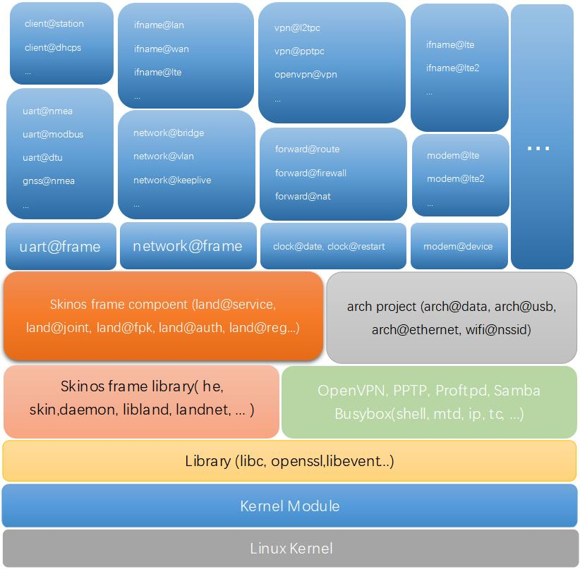

# SkinOS系统的来由   
Linux, Ubuntu, Openwrt未统一或规范应用程序与管理员之间的接口, 导致对管理员或使用者重复学习重复开发, 为了解决此问题而开发了此系统   
- SkinOS最重要的目标是在应用程序与管理员之间提供一套 **统一的接口** 规范   
- 开发者以 **统一的接口** 的规范开发应用程序, 并给出接口文档   
- 管理员及使用者通过 **统一的接口** 对应用程序进行管理   
- 也可通过 **统一的接口** 二次开发应用或定制化应用   
- 基于 **统一的接口** 在网络层面实现远程调用, 实现更统一更智能的 **物联网**   
- 基于 **统一的接口** 实现跨平台, 隔离硬件与管理者   
   

# SkinOS API简介   
SkinOS API即 **统一的接口**
- 以 **组件** 来划分 **功能**, 每个组件对应不同的功能项   
- 且以 **组件** 的方式对外提供接口   
   
- 以组件的方式对象化系统中所有硬件及功能, 向上提供 **接口** 及 **配置**   
    - 组件的配置, 为功能项或硬件的配置, 一个JSON格式的对象, 掉电保存   
        - 可 **命令行**, **远程**, **编程** 查询组件的配置   
        - 可 **命令行**, **远程**, **编程** 修改组件的配置   
    - 组件接口(API), 功能项或硬件向外提供的接口, 完成指定的功能或信息的交互   
        - 可 **命令行** 调用组件的接口   
        - 可 **远程** 调用组件的接口   
        - 可 **编程** 调用组件的接口   
- **管理者** 对 **硬件或功能项** 以上面介绍的两种方式对其管理和交互   

# SkinOS系统架构   
- 通过 **组件** 对Linux的硬件及功能封装，向上层提供调用接口   
- **硬件或功能项** 都对应着指定的 **组件**   
- 多个相关硬件或功能项的组件组成一个 **项目**   
- **组件** 又可通过 **SkinOS API** 相互调用及依赖, 实现复用   
   

# SkinOS适用的场景   
以Linux为基础的SkinOS即可运行于嵌入式平台中当 **网关** 使用, 也可以运行于X86平台当 **云管理平台** 使用   
- 可运行用嵌入式平台中, 如 **网关**, 路由器, 各种终端智能设备   
- 可运行用X86的工控机中, 如企业网关, 无人机器, 工控设备, 控制器等   
- 栽剪后还可运行在Ubuntu系统上, 如 **网关云管理**, 云服务器, 管理服务器, 应用服务器等   

接下来将介绍 **网关** 及 **网关云管理**   


# 网关   
**网关** 及路由类产品有以下特点:   
- 芯片方案众多, 各种厂商不同的系列, 并提供各种不同的SDK    
- 更新快, 几乎每年都有新的芯片方案发布  
- 接口丰富, 各种外设以各种方式连接MCU   

以上原因导致网关产品维护复杂, 更新换代及对接外设带来大量重复工作, 因此非常合适SkinOS   
在网关中运行SkinOS, 提供统一的API, 并相对传统网关具有以下优势   
- 更容易维护及管理和使用, 更新换代减少大量重复学习   
- 在SkinOS上开发应用复用性更好, 更好移植
- 接口丰富更智能化   
- SkinOS的全新的开发方式给应用程序更多的交互性   
- 统一的API实现真正的物与物的交互, 并且在升级换代中有更好的延续性   

下图为运行SkinOS的网关常用的 **功能项及硬件** 对应的组件   
   
**land** 项目, SkinOS核心项目, 管理网关的基本功能   
- **[网关基本信息](https://gitee.com/tiger7/doc/blob/master/com/land/machine.md)** , machine组件, 命名为 **land@machine**, 别名为 **machine**   
- **[系统服务](https://gitee.com/tiger7/doc/blob/master/com/land/service.md)**, service组件, 命名为 **land@service**, 别名为 **service**   
- **[用户名密码及权限](https://gitee.com/tiger7/doc/blob/master/com/land/auth.md)**, auth组件, 命名为 **land@auth**, 别名为 **auth**   
- **[日志管理](https://gitee.com/tiger7/doc/blob/master/com/land/syslog.md)**, syslog组件, 命名为 **land@syslog**, 别名为 **log**   

**client** 项目, 管理所有客户端   
- **[访问控制](https://gitee.com/tiger7/doc/blob/master/com/client/global.md)**, global组件, 命名为 **client@global**   
- **[终端管理](https://gitee.com/tiger7/doc/blob/master/com/client/station.md)**, station组件, 命名为 **client@station**   

**forward** 项目, 管理路由转发功能   
- **[应用层网关](https://gitee.com/tiger7/doc/blob/master/com/forward/alg.md)**, alg组件, 命名为 **forward@alg**  
- **[默认路由表](https://gitee.com/tiger7/doc/blob/master/com/forward/route.md)**, route组件, 命名为 **forward@route**   
- **[防火墙](https://gitee.com/tiger7/doc/blob/master/com/forward/firewall.md)**, firewall组件, 命名为 **forward@firewall**   
- **[端口映射](https://gitee.com/tiger7/doc/blob/master/com/forward/nat.md)**, nat组件, 命名为 **forward@nat**   

**ifname** 项目, 管理网关所有的网络连接   
- **[LTE/NR(4G/5G)网络](https://gitee.com/tiger7/doc/blob/master/com/ifname/lte.md)**, lte连接组件, 第一个LTE命名为 **ifname@lte**, 第二个LTE命名为 **ifname@lte2**   
- **[有线宽带(WAN)](https://gitee.com/tiger7/doc/blob/master/com/ifname/wan.md)**, wan连接组件, 第一个WAN命名为 **ifname@wan**, 第二个WAN命名为 **ifname@wan2**   
- **[本地网络(LAN)](https://gitee.com/tiger7/doc/blob/master/com/ifname/lan.md)**, lan连接组件, 第一个LAN命名为 **ifname@lan**, 第二个LAN命名为 **ifname@lan2**   
- **[无线连网(WISP)](https://gitee.com/tiger7/doc/blob/master/com/ifname/wisp.md)**, wisp连接组件, 第一个WISP命名为 **ifname@wisp**, 第二个WISP命名为 **ifname@wisp2**   

**clock** 项目, 时间相关的管理   
- **[系统时间](https://gitee.com/tiger7/doc/blob/master/com/clock/date.md)**, date组件, 命名为 **clock@date**   
- **[自动重启](https://gitee.com/tiger7/doc/blob/master/com/clock/restart.md)**, restart组件, 命名为 **clock@restart**   
- **[NTP服务器](https://gitee.com/tiger7/doc/blob/master/com/clock/ntps.md)**, ntps组件, 命名为 **clock@ntps**   

**wui** 项目, WEB服务   
- **[WEB服务器](https://gitee.com/tiger7/doc/blob/master/com/wui/admin.md)**, admin组件, 命名为 **wui@admin**   

**tui** 项目, 终端命令服务   
- **[SSH服务器](https://gitee.com/tiger7/doc/blob/master/com/tui/ssh.md)**, ssh组件, 命名为 **tui@ssh**    
- **[TELNET服务器](https://gitee.com/tiger7/doc/blob/master/com/tui/telnet.md)**, telnet组件, 命名为 **tui@telnet**   

**wifi** 项目, 所有802.11abgn/ac无线接口管理   
- **[2.4G热点](https://gitee.com/tiger7/doc/blob/master/com/wifi/nssid.md)**, nssid组件, 第一个SSID(2.4G)命名为 **wifi@nssid**, 第二个SSID(2.4G)命名为 **wifi@nssid2**   
- **[5.8G热点](https://gitee.com/tiger7/doc/blob/master/com/wifi/assid.md)**, assid组件, 第一个SSID(5.8G)命名为 **wifi@assid**, 第二个SSID(5.8G)命名为 **wifi@assid2**   
- **[2.4G网卡](https://gitee.com/tiger7/doc/blob/master/com/wifi/nsta.md)**, nsta组件, 命名为 **wifi@nsta**   
- **[5.8G网卡](https://gitee.com/tiger7/doc/blob/master/com/wifi/asta.md)**, asta组件, 命名为 **wifi@asta**   
- **[2.4G基带](https://gitee.com/tiger7/doc/blob/master/com/wifi/n.md)**, n组件, 命名为 **wifi@n**   
- **[5.8G基带](https://gitee.com/tiger7/doc/blob/master/com/wifi/a.md)**, a组件, 命名为 **wifi@a**   

**modem** 项目, LTE/NR基带管理   
- **[LTE/NR(4G/5G)基带](https://gitee.com/tiger7/doc/blob/master/com/modem/lte.md)**, lte组件, 第一个LTE/NR基带命名为 **modem@lte**, 第二个LTE/NR基带命名为 **modem@lte2**   

**io** 项目, IO口管理及相关协议的实现   
- **[IO口管理](https://gitee.com/tiger7/doc/blob/master/com/io/agent.md)**, agent组件, 命名为 **io@agent**   

**gnss** 项目, 定位功能及相关的协议实现   
- **[全球定位](https://gitee.com/tiger7/doc/blob/master/com/gnss/nmea.md)**, nmea组件, 命名为 **gnss@nmea**   

**uart** 项目, 串口(UART)相关的功能及协议实现  
- **[串口管理](https://gitee.com/tiger7/doc/blob/master/com/uart/serial.md)**, serial组件, 第一个UART命名为 **uart@serial**, 第二个UART命名为 **uart@serial2**   

**arch** 项目, 底层硬件相关的项目   
- **[GPIO管理](https://gitee.com/tiger7/doc/blob/master/com/arch/gpio.md)**, gpio组件, 命名为 **arch@gpio**   
- **[以太网管理](https://gitee.com/tiger7/doc/blob/master/com/arch/ethernet.md)**, ethernet组件, 命名为 **arch@ethernet**   
- **[PCI设备管理](https://gitee.com/tiger7/doc/blob/master/com/arch/pci.md)**, pci组件, 命名为 **arch@pci**   
- **[USB设备管理](https://gitee.com/tiger7/doc/blob/master/com/arch/usb.md)**, usb组件, 命名为 **arch@usb**   
- **[数据管理](https://gitee.com/tiger7/doc/blob/master/com/arch/data.md)**, data组件, 命名为 **arch@data**   
- **[固件管理](https://gitee.com/tiger7/doc/blob/master/com/arch/firmware.md)**, firmware组件, 命名为 **arch@firmware**   


# 管理网关   

## 终端管理命令行管理网关   
SkinOS提供终端管理命令行, 用户可通过终端管理命令行管理并调用网关上的功能   

### 1. 登陆网关终端管理命令行   
- 通过Telnet客户端登陆网关进入 **终端管理命令行**   
- 通过SSH客户端登陆网关进入 **终端管理命令行**   
- 通过串口连接网关进入 **终端管理命令行**   

*登陆帐号与网页管理界面帐号相同*   
```
dimmalex@HMS:~$ telnet 192.168.8.1
Trying 192.168.8.1...
Connected to 192.168.8.1.
Escape character is '^]'.

LTE&NR-Gateway login: admin
Password: 

               EEEEEEEEE   LL           FFFFFFFFF
               EE          LL           FF
               EE          LL           FF
               EEEEEEEEE   LL           FFFFFFFFF
               EE          LL           FF
               EE          LL           FF
        Ashy   EEEEEEEEE   LLLLLLLLLL   FF

 -----------------------------------------------------------
 Command Help
 -----------------------------------------------------------
 @ ----------------------- List all the project
 @? ---------------------- List all the static component
 @@ ---------------------- List all the dynamic component
 <com> ------------------- Show component configure
 <com>:<config> ---------- Get component configure attribute
 <com>:<config>=<value> -- Set component configure attribute
 -----------------------------------------------------------
$ 
```   

### 2. 命令行查询网关配置   
示例查询网关基本配置, 即查询组件 **land@machine** 的配置, 命令行中给出组件名即可   
```shell
$ land@machine                         # HE Command show the gateway basic configure
{
    "mode":"misp",
    "name":"LTE&NR-Gateway",
    "mac":"00:03:7F:12:00:08",
    "macid":"00037F120008",
    "language":"en",
    "cfgversion":"8"
}
```

### 3. 命令行修改网关配置   
示例修改网关的名称为MyGateway, 即修改组件 **land@machine** 的 **name** 的值   
```shell
$ land@machine:name=MyGateway          # HE Command modify the gateway basic configure
ttrue
```

### 4. 命令行调用网关接口   
示例获取网关基本状态, 即调用组件 **land@machine** 的 **status** 接口, 命令行中给出组件名及接口名称   
```shell
$ land@machine.status                  # HE Command show the gateway basic status
{
    "mode":"gateway",
    "name":"MyGateway",
    "platform":"smtk2",
    "hardware":"mt7621",
    "custom":"d228",
    "scope":"std",
    "version":"v7.3.0916",
    "livetime":"19:39:04:2",
    "current":"23:10:10:10:08:2023",
    "mac":"00:03:7F:12:00:08",
    "model":"5228",
    "cmodel":"",
    "cfgversion":"8"
}
$ 
```   
**更多介绍见此文档 [<<终端管理命令行使用介绍>>](https://gitee.com/tiger7/doc/blob/master/use/tui_use_cn.md)**   


## TCP(JSON)控制协议管理网关   
网关此协议功能默认关闭, 需要通过 **网页管理界面** 或 **终端管理命令行** 打开此功能后使用, 通过此协议可以管理并调用网关上的功能   

### 1. 查询网关配置   
连接TCP端口22220后发送, 示例查询设备基本配置, 即查询组件 **land@machine** 的配置   
```json

{
    "cmd1":"land@machine"            /* Query the gateway basic configure {"cmd1":"land@machine"} */
}
```   
接收   
```json
{
    "cmd1":
    {
        "mode":"misp",
        "name":"LTE&NR-Gateway",
        "mac":"00:03:7F:12:00:08",
        "macid":"00037F120008",
        "language":"en",
        "cfgversion":"8"
    }
}
```

### 2. 修改网关配置   
连接TCP端口22220后发送, 示例修改设备的名称为MyGateway, 即修改组件 **land@machine** 的 **name** 的值   
```json

{
    "cmd1":"land@machine:name=MyGateway"     /* Modify the gateway basic configure {"cmd1":"land@machine:name=MyGateway"} */
}
```   
接收   
```json
{
    "cmd1":"ttrue"
}
```

### 3. 调用网关接口   
连接TCP端口22220后发送, 示例获取设备基本状态, 即调用组件 **land@machine** 的 **status** 接口   
```json
{
    "cmd1":"land@machine.status"     /* Query the gateway basic status {"cmd1":"land@machine.status"} */
}
```   
接收   
```json
{
    "cmd1":
    {
        "mode":"gateway",
        "name":"MyGateway",
        "platform":"smtk2",
        "hardware":"mt7621",
        "custom":"d228",
        "scope":"std",
        "version":"v7.3.0916",
        "livetime":"19:39:04:2",
        "current":"23:10:10:10:08:2023",
        "mac":"00:03:7F:12:00:08",
        "model":"5228",
        "cmodel":"",
        "cfgversion":"8"
    }
}
```   
**更多介绍见此文档 [<<本地被管理协议说明>>](https://gitee.com/tiger7/doc/blob/master/protocol/localport/localport_protocol_cn.md)**   


## 网页管理界面管理网关  
SkinOS提供网页管理界面, 用户可登陆网页管理界面后管理网关, **更多介绍见此文档 [<<网页管理界面使用说明>>](https://gitee.com/tiger7/doc/blob/master/use/wui_use_cn.md)**   
网页管理界面使用了 **HTTP(JSON)控制协议** 与网关交互, ***此接口后续会升级***, 以下是此协议的介绍   
### 1. 登录   
方法: POST   
URL: http://GatewayIP:GatewayPORT/action/login   
内容: username=XXXXXXX&password=XXXXXXX   
使用用户名admin密码admin登录并获取cookies   
```
dimmalex@HMS:~$ curl -XPOST http://192.168.8.1/action/login -d'username=admin&password=admin' -c ./gateway.cookies
<html><head></head><body>
        This document has moved to a new <a href="http://192.168.8.1/index.html">location</a>.
        Please update your documents to reflect the new location.
</body></html>
```   
成功时收到   
```
<html><head></head><body>
        This document has moved to a new <a href="http://192.168.8.1/index.html">location</a>.
        Please update your documents to reflect the new location.
</body></html>
```   
失败时收到   
```
<html><head></head><body>
        This document has moved to a new <a href="http://192.168.8.1/login.html?warn=loginfailed">location</a>.
        Please update your documents to reflect the new location.
</body></html>
```

### 2. 与网关通信   
通过POST **HE指令** 到/action/he来让网关执行实现与网关的交互
POST格式如下:   
```
&he=UrlEncode(Base64(HE Command))&he2=UrlEncode(Base64(HE Command2))&&he2=UrlEncode(Base64(HE Command3))...
```
**所有的HE指令可以终端管理命令行中执行, 因此在 [<<终端管理命令行使用介绍>>](https://gitee.com/tiger7/doc/blob/master/use/tui_use_cn.md) 文档中有更多的HE指令的介绍**   

### 查询网关配置   
示例查询网关基本配置, 即查询组件land@machine的配置   
方法: POST   
URL: http://GatewayIP:GatewayPORT/action/he   
内容: &he=UrlEncode(Base64(land@machine))   
```
dimmalex@HMS:~$ curl -XPOST http://192.168.8.1/action/he -d'&he=bGFuZEBtYWNoaW5l' -b ./gateway.cookies
eyJoZSI6eyJtb2RlIjoibWlzcCIsIm5hbWUiOiJMVEUmTlItR2F0ZXdheSIsIm1hYyI6IjAwOjAzOjdGOjEyOjAwOjA4IiwibWFjaWQiOiIwMDAzN0YxMjAwMDgiLCJsYW5ndWFnZSI6ImVuIiwiY2ZndmVyc2lvbiI6IjgifX0=
dimmalex@HMS:~$
```   
收到   
```
eyJoZSI6eyJtb2RlIjoibWlzcCIsIm5hbWUiOiJMVEUmTlItR2F0ZXdheSIsIm1hYyI6IjAwOjAzOjdGOjEyOjAwOjA4IiwibWFjaWQiOiIwMDAzN0YxMjAwMDgiLCJsYW5ndWFnZSI6ImVuIiwiY2ZndmVyc2lvbiI6IjgifX0=
```   
收到并使用base64解码   
```
{"he":{"mode":"misp","name":"LTE&NR-Gateway","mac":"00:03:7F:12:00:08","macid":"00037F120008","language":"en","cfgversion":"8"}}
```   
最终得到   
```
{"mode":"misp","name":"LTE&NR-Gateway","mac":"00:03:7F:12:00:08","macid":"00037F120008","language":"en","cfgversion":"8"}
```

### 修改网关配置   
示例修改网关的名称为MyGateway, 即修改组件land@machine的name的值   
方法: POST   
URL: http://GatewayIP:GatewayPORT/action/he   
内容: &he=UrlEncode(Base64(land@machine:name=MyGateway))   
```
dimmalex@HMS:~$ curl -XPOST http://192.168.8.1/action/he -d'&he=bGFuZEBtYWNoaW5lOm5hbWU9TXlHYXRld2F5' -b ./gateway.cookies
eyJoZSI6dHJ1ZX0=
dimmalex@HMS:~$
```   
收到   
```
eyJoZSI6dHJ1ZX0=
```   
收到并使用base64解码   
```
{"he":true}
```   
最终得到true表示操作成功   
```
true
```

### 调用网关接口   
示例获取设备基本状态, 即调用组件land@machine的status接口   
方法: POST   
URL: http://GatewayIP:GatewayPORT/action/he   
内容: &he=UrlEncode(Base64(land@machine.status))   
```
dimmalex@HMS:~$ curl -XPOST http://192.168.8.1/action/he -d'&he=bGFuZEBtYWNoaW5lLnN0YXR1cw==' -b ./gateway.cookies
eyJoZSI6eyJtb2RlIjoiZ2F0ZXdheSIsIm5hbWUiOiJNeUdhdGV3YXkiLCJwbGF0Zm9ybSI6InNtdGsyIiwiaGFyZHdhcmUiOiJtdDc2MjEiLCJjdXN0b20iOiJkMjI4Iiwic2NvcGUiOiJzdGQiLCJ2ZXJzaW9uIjoidjcuMy4wOTE2IiwibGl2ZXRpbWUiOiIxOTozOTowNDoyIiwiY3VycmVudCI6IjIzOjEwOjEwOjEwOjA4OjIwMjMiLCJtYWMiOiIwMDowMzo3RjoxMjowMDowOCIsIm1vZGVsIjoiNTIyOCIsImNtb2RlbCI6IiIsImNmZ3ZlcnNpb24iOiI4In19
dimmalex@HMS:~$
```   
收到   
```
eyJoZSI6eyJtb2RlIjoiZ2F0ZXdheSIsIm5hbWUiOiJNeUdhdGV3YXkiLCJwbGF0Zm9ybSI6InNtdGsyIiwiaGFyZHdhcmUiOiJtdDc2MjEiLCJjdXN0b20iOiJkMjI4Iiwic2NvcGUiOiJzdGQiLCJ2ZXJzaW9uIjoidjcuMy4wOTE2IiwibGl2ZXRpbWUiOiIxOTozOTowNDoyIiwiY3VycmVudCI6IjIzOjEwOjEwOjEwOjA4OjIwMjMiLCJtYWMiOiIwMDowMzo3RjoxMjowMDowOCIsIm1vZGVsIjoiNTIyOCIsImNtb2RlbCI6IiIsImNmZ3ZlcnNpb24iOiI4In19
```   
收到并使用base64解码   
```
{"he":{"mode":"gateway","name":"MyGateway","platform":"smtk2","hardware":"mt7621","custom":"d228","scope":"std","version":"v7.3.0916","livetime":"19:39:04:2","current":"23:10:10:10:08:2023","mac":"00:03:7F:12:00:08","model":"5228","cmodel":"","cfgversion":"8"}}
```   
最终得到   
```
{"mode":"gateway","name":"MyGateway","platform":"smtk2","hardware":"mt7621","custom":"d228","scope":"std","version":"v7.3.0916","livetime":"19:39:04:2","current":"23:10:10:10:08:2023","mac":"00:03:7F:12:00:08","model":"5228","cmodel":"","cfgversion":"8"}
```   


# 云管理   
为远程及批量管理运行SkinOS的网关产品, 基于SkinOS栽剪后在Ubunut上开发的 **云管理(SkinCloud)**, 具有以下功能   
- 收集网关及网关上传感器的信息   
- 远程管理配置网关, 升级网关等常的云平台管理功能   
- 远程登录网关及其下的设备   
- 提供内网穿透的功能  
- 提供自组网功能, 可将接入的网关组成局域网或广域网   

下图为云管理常用的 **功能项** 对应的组件   
   
**land** 项目, SkinOS核心项目, 基本功能   
- **[云管理基本信息](https://gitee.com/tiger7/doc/blob/master/com/land/machine.md)** , machine组件, 命名为 **land@machine**, 别名为 **machine**   
- **[系统服务](https://gitee.com/tiger7/doc/blob/master/com/land/service.md)**, service组件, 命名为 **land@service**, 别名为 **service**   
- **[用户名密码及权限](https://gitee.com/tiger7/doc/blob/master/com/land/auth.md)**, auth组件, 命名为 **land@auth**, 别名为 **auth**   
- **[日志管理](https://gitee.com/tiger7/doc/blob/master/com/land/syslog.md)**, syslog组件, 命名为 **land@syslog**, 别名为 **log**   

**clock** 项目, 时间相关的管理   
- **[系统时间](https://gitee.com/tiger7/doc/blob/master/com/clock/date.md)**, date组件, 命名为 **clock@date**   
- **[自动重启](https://gitee.com/tiger7/doc/blob/master/com/clock/restart.md)**, restart组件, 命名为 **clock@restart**   
- **[NTP服务器](https://gitee.com/tiger7/doc/blob/master/com/clock/ntps.md)**, ntps组件, 命名为 **clock@ntps**   

**wui** 项目, WEB服务   
- **[WEB服务器](https://gitee.com/tiger7/doc/blob/master/com/wui/admin.md)**, admin组件, 命名为 **wui@admin**, 此WEB服务为云管理的网页管理界面 用于让管理员登陆后配置云管理   

**devms** 项目, 管理所有接入网关的项目   
- **[接入管理](https://gitee.com/tiger7/doc/blob/master/com/devms/devport.md)**, devport组件, 命名为 **devms@devport**, 别名为 **dport**, 专用于收集网关上报的状态, 规类到指定的用户帐号下   
- **[实时管理](https://gitee.com/tiger7/doc/blob/master/com/devms/heport.md)**, heport组件, 命名为 **devms@heport**, 别名为 **hport**, 实现与网关实时通信   
- **[内网穿透](https://gitee.com/tiger7/doc/blob/master/com/devms/pport.md)**, pport组件, 命名为 **devms@pport**, 别名为 **pport**, 实现内网穿透   
- **[网页服务](https://gitee.com/tiger7/doc/blob/master/com/devms/webs.md)**, webs组件, 命名为 **devms@webs**, 此WEB服务提供管理网关的用户网页界面, 用于让用户登录后管理网关   
- **[API接口](https://gitee.com/tiger7/doc/blob/master/com/devms/api_device.md)**, api组件, 命名为 **devms@api**, 别名为 **devapi**, 通过此组件向外提供命令行及编程接口   
    - **[管理网关](https://gitee.com/tiger7/doc/blob/master/com/devms/api_device.md)**, 对接入网关的管理   
    - **[管理用户](https://gitee.com/tiger7/doc/blob/master/com/devms/api_user.md)**, 对云管理上用户的管理   
    - **[固件升级](https://gitee.com/tiger7/doc/blob/master/com/devms/api_firmware.md)**, 对云管理上固件及网关升级的管理   
    - **[实时管理](https://gitee.com/tiger7/doc/blob/master/com/devms/api_heport.md)**, 实时与接入平台的网关交互   
    - **[内网穿透](https://gitee.com/tiger7/doc/blob/master/com/devms/api_map.md)**, 管理内网穿透   
    - **[自组网](https://gitee.com/tiger7/doc/blob/master/com/devms/api_network.md)**, 管理自组网   

# 云管理使用说明   
云管理运行在Ubunut系统上, 提供用户网页界面及接口(API)来管理接入的网关   
- **命令行接口**, 用户可在Ubunut上执行命令管理网关   
- 提供 **用户网页界面** 来管理指定用户下接入的网关   
- 提供 **编程接口(API)** 管理网关   

## 云管理中命令行的使用   
云管理运行在Ubunut系统上后, 登录Ubuntu后可在命令行中管理接入的网关   

### 1. 命令行查询指定用户下的网关列表  
示例查询用户名为ashyelf下所有网关   
```shell
ubuntu@VM-0-8-ubuntu:~$ he devms@api.device_listv[ashyelf]
{
    "00037F120910":
    {
        "mode":"gateway",
        "name":"MyGateway",
        "broken":"disable",
        "platform":"smtk2",
        "hardware":"mt7621",
        "custom":"d228",
        "scope":"std",
        "version":"v7.4.0610",
        "livetime":"09:08:08:2",
        "current":"02:04:55:08:04:2024",
        "mac":"00:03:7F:12:09:10",
        "macid":"00037F120910",
        "model":"5228",
        "magic":"0D8339C20232FFFF",
        "cfgversion":"20240585",
        "wui_port":"8888",
        "telnet_port":"2323",
        "ssh_port":"22",
        "local_ip":"192.168.31.254",
        "ifname":"ifname@wan",
        "extern_ip":"111.221.193.120",
        "rx_bytes":"20144422893",
        "tx_bytes":"14270927555",
        "online":"09:51:52:15",
        "key":"9dbf91fcec11dafcf9dc3e2591ad1b74"
    },
    "88124E202B30":
    {
        "mode":"gateway",
        "name":"V520-202B30",
        "platform":"smtk2",
        "hardware":"mt7621",
        "custom":"v520",
        "scope":"std",
        "version":"v7.4.0603",
        "mac":"88:12:4E:20:2B:30",
        "macid":"88124E202B30",
        "model":"V520",
        "oem":"31232",
        "magic":"C3141B2CD2645830",
        "wui_port":"80",
        "telnet_port":"23",
        "ssh_port":"22",
        "local_ip":"192.168.100.1",
        "comment":"陪测"
    }
}
ubuntu@VM-0-8-ubuntu:~$
```

### 2. 命令行远程查询指定网关配置   
示例查询macid为00037F120910网关基本配置, 即查询其组件land@machine的配置   
```shell
ubuntu@VM-0-8-ubuntu:~$ he devms@heport.he[00037F120910,machine]
{
    "mode":"gateway",
    "name":"MyGateway",
    "broken":"disable",
    "mac":"00:03:7F:12:09:10",
    "macid":"00037F120910",
    "language":"cn",
    "version":"v7.4.0610",
    "cfgversion":"20240585"
}
```

### 2. 命令行远程修改指定网关配置   
示例修改macid为00037F120910网关的名称为MyGateway, 即修改其组件land@machine的name的值   
```shell
ubuntu@VM-0-8-ubuntu:~$ he devms@heport.he[00037F120910,land@machine:name=MyGateway]
ttrue
ubuntu@VM-0-8-ubuntu:~$
```

### 3. 命令行远程调用指定网关接口   
示例获取macid为00037F120910网关基本状态, 即调用其组件land@machine的status接口   
```shell
ubuntu@VM-0-8-ubuntu:~$ he devms@heport.he[00037F120910,land@machine.status]
{
    "mode":"gateway",
    "name":"MyGateway",
    "broken":"disable",
    "platform":"smtk2",
    "hardware":"mt7621",
    "custom":"d228",
    "scope":"std",
    "version":"v7.4.0610",
    "livetime":"09:14:24:2",
    "current":"02:11:11:08:04:2024",
    "mac":"00:03:7F:12:09:10",
    "macid":"00037F120910",
    "model":"5228",
    "magic":"0D8339C20232FFFF",
    "cfgversion":"20240585",
    "wui_port":"8888",
    "telnet_port":"2323",
    "ssh_port":"22",
    "local_ip":"192.168.31.254"
}
ubuntu@VM-0-8-ubuntu:~$
```   
**更多介绍见此文档 [<<云管理命令行使用介绍>>](https://gitee.com/tiger7/doc/blob/master/use/cloud_tui_use_cn.md)**   


## 云管理上用户网页界面的使用   
网关接入云管理时需要指定用户, 因此通过此用户登录 **用户网页界面** 即可对其管理  
**更多介绍见此文档 [<<云管理使用说明>>](https://gitee.com/tiger7/doc/blob/master/use/cloud_wui_use_cn.md)**   

