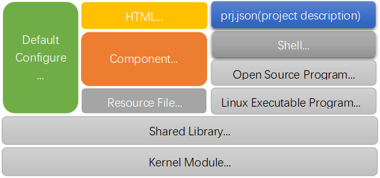
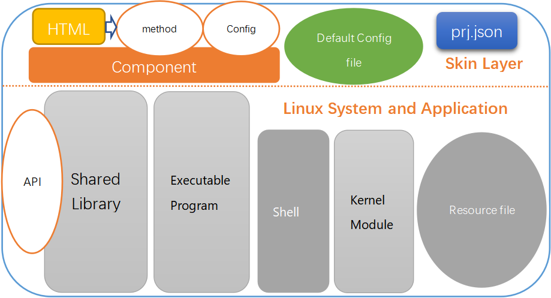
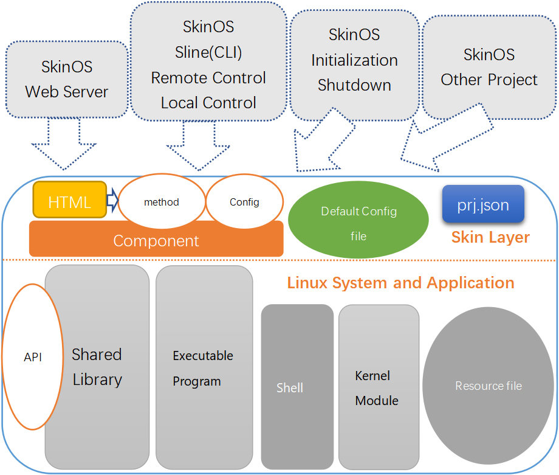

# 简介 
基于Linux操作系统的资源对边缘计算的研究及开发, 针对软件及硬件两个方面做出创新性的改变以适应市场多样化及复杂化的需求
- 软件开发 **软件基础开发平台**，对嵌入式硬件进行统一封装， 向用户及开发者提供统一且可扩展性的接口
- 硬件开发高度集成且接口丰富的 **路由模块** 或 **边缘计算网关模块**， 基于模块开发针对性的路由产品及终端计算产品原型, 并为高度市场化的原型产品设计专用硬件


# 硬件产品(路由模块) 
用于嵌入于客户的设备或产品中帮助其接入互联网并完成业务数据相关的转换转发、触发、定时任务等计算, 或基于路由模块加上扩展板形成完整的路由器产品用于各种应用环境中
- **LTE路由模块** <[D218规格书](https://gitee.com/tiger7/doc/blob/master/product/d218/spec.md)>
    提供 LTE(4G)接入, 2.4G WIFI(300M双天线)接入或覆盖, 以太网(100M)接入或引出 的多功能高可扩展的路由模块, 并带有 双串口(RS485/RS232/TTL三模式)、多路IO口 及对应的数据转换转发等计算能力， 并提供完整的SDK及开发接口， SDK中已集成多种控制协议可帮助开发者实现本地及远程控制本模块
- **NR(5G)&WIFI5路由模块** <[D228规格书](https://gitee.com/tiger7/doc/blob/master/product/d228/spec.md)>
    提供 NR(5G)及LTE(4G)接入, 5.8G WIFI(800M双天线)接入或覆盖, 以太网(1000M)接入或引出 的多功能高可扩展的路由模块, 并带有 三串口(RS485/RS232/TTL)、多路IO口 及对应的数据转换转发等计算能力， 并提供完整的SDK及开发接口， SDK中已集成多种控制协议可帮助开发者实现本地及远程控制本模块
- **NR(5G)&WIFI6边缘计算网关模块** <[D618规格书](https://gitee.com/tiger7/doc/blob/master/product/d618/spec.md)>(*资料暂暂未上传*)
    提供 NR(5G)及LTE(4G)接入, 5.8G WIFI6(1200M双天线)接入或覆盖, 以太网(1000M)接入或引出 的多功能高可扩展的路由模块, 并带有 蓝牙5.0、CAN接口、HDMI2.0音视频输出, 音频输入输出、MIPI-CSI摄象头接口、USB2.0接口(TYPE C)、三串口(RS485/RS232/TTL)、多路IO口 及对应的数据转换转发等计算能力， 并提供完整的SDK及开发接口， SDK中已集成多种控制协议可帮助开发者实现本地及远程控制本模块


# 软件基础开发平台
使用Linux操作系统提供的各项功能, 将嵌入式硬件的各种资源包装成相对统一的 **开发环境**
致力在嵌入式硬件与软件之间插入 **开发环境** 中间层系统
剥离出两种方向的开发:
 - **开发环境** 的开发: 移植更多的嵌入式硬件平台, 封装更多硬件资源, 提供更多的API
 - **应用软件** 的开发: 基于开发环境提供的API开发更多的应用, 且应用也以API的方式向其它应用提供接口, 各种应用可以很方便的相互叠加, 满足客户的各种个性需求

通过以上方式使基于本 **开发环境** 开发的 **应用软件**, 据有以下优势：
- 可以无代码级修改的移植到 **开发环境** 支持的任意嵌入式硬件平台中, 改变嵌入式中重复开发及移植或适配现状
- 可以非常方便的向外提供各种调用接口
- 基于系统向外提供的协议、用户界面等直接实现对应管理配置或调用其接口
- 在API稳定的情况下未来嵌入式芯片更新换代中节约研发成本

**软件基础开发平台** 包含有 **开发环境** 跟产品对应的 **应用软件**, 称之为 **SkinSDK**
通过 **SkinSDK** 编译出来的运行系统称为 **SkinOS**


# 软件基础开发平台下载及编译

#### 1. 开发环境下载
在Ubuntu下（建议使用20.04或18.04）执行以下命令下载开发环境(请先安装git及make)
```shell
git clone https://gitee.com/tiger7/tiger7.git
```
*或者支持访问github的可以从github上下载*
```shell
git clone https://github.com/skinos7/tiger7.git
```

#### 2. Ubuntu上安装必要的开发工具
以上指令执行完成后会生成tiger7目录, 此目录是开发环境的顶层目录, 进入此目录
```shell
cd tiger7
```
执行以下指令可在Ubuntu下自动安装一些编译需要的工具
```shell
make ubuntu_preset
```

#### 3. 指定需要开发的产品
执行以下指令指定产品型号， 要求输入产品 **完整型号**
*在产品的WEB管理界面的 **定制开发** 菜单下的 **SDK下载** 菜单项页面上会有产品对应的示例, 当中有对应产品的完整型号*
```shell
make pid gBOARDID=产品完整型号

# 如D218的产品输入以下指令:
# make pid gBOARDID=mtk2-mt7628-d218

# 如3218/5218的产品输入以下指令:
# make pid gBOARDID=mtk2-mt7628-r600

# 如D228的产品输入以下指令:
# make pid gBOARDID=mtk2-mt7621-d228

# 如V520的产品输入以下指令：
# make pid gBOARDID=mtk2-mt7621-v520
```

#### 4. 更新应用软件
之后再执行以下指令来更新应用软件
```shell
make update
```
通过以上四步即可更新产品对应的完整的编译环境及应用软件

#### 5. 更新应用软件菜单并选择编译嵌入式应用软件包
执行 
```shell
make menu
```
将会刷新菜单项, 之后再执行 
```shell
make menuconfig
```
显示产品对应的软件包菜单， 可进去勾选或去勾选软件包, 所有本系统的项目都会在 **Skin system** 菜单项下
***注意: 如果不需要调整产品上的应用功能请不要勾选或去勾选操作, 直接保存退出即可***

#### 6. 编译固件 
执行
```shell
make dep
make
```
即可编译产品型号对应的固件升级包， 固件升级包以.zz结尾， 存放在tiger7目录下的build目录

#### 7. 将编译出来的固件升级到产品上
在设备网页管理界面中的 **系统=>软件管理=>软件更新** 来点选.zz结尾的固件升级包来升级固件
如需升级的同时恢复出厂设置可将固件的后缀名(.zz)修改为.default后现通过网页管理界面升级即可


# 系统框架
- SkinOS中通过组件或共享库的方式对Linux底层封装，向上提供调用接口
- SkinOS中可管理的对象都是一个个组件
- 多个相关或相类功能的组件归类到相同的项目中形成一个应用软件


# 系统中的项目的介绍
- 应用软件在SkinSDK中对应的是 **项目(project)**， 每个 **项目(project)** 都有对应的目录，目录存放应用软件所有的源代码及各种资源文件
- SkinSDK的 **项目(project)** 都存放在都在 **[tiger7/project](./project/)** 目录下
- **项目(project)** 编译后会生成 **FPK安装包**, FPK安装包被用于安装到SkinOS中
- SkinSDK中开发都需要创建 **项目(project)** 
- 以下是 **项目(project)** 常见的组成图



**[prj.json](https://gitee.com/tiger7/doc/blob/master/dev/prj.json.md)** 是对整个 **项目(project)** 的描述，它是一个JSON格式的文件，会在 **项目(project)** 打包编译时打包到FPK安装包中
- **项目(project)** 中必须存在此文件
- 它的信息在编译时指导编译过程
- 在将 **项目(project)** 打包成FPK时指导部分打包过程，在FPK安装到系统时指导安装过程
- 在系统启动前向系统注册启动项
- 在系统关机前注册关机项
- 向系统注册事件处理项，在系统发生事件时触发调用对应的组件接口
- 向系统注册网页界面

**Component** 为 **项目(project)** 中的组件,  **项目(project)** 通过组件向系统及其它项目提供统一的管理接口

**Default Configure** 为 **项目(project)** 的默认配置

**HTML** 为 **项目(project)** 的网页管理界面

**Shell** 可能的Shell脚本

**Open Source Program** 可能的一些开源应用程序

**Linux Executable Program** 可能的一些Linux可执行程序

**Shared Library** 共享库

**Kernel Module** 内核模块


# 系统中的项目架构图



**Skin Layer**, 此层向SkinOS提供管理接口, SkinOS通过此管理接口实现对系统中所有的项目统一管理
- **Component** 向SkinOS提供接口
- **Default Configure file** 提供默认配置
- **HTML** 向SkinOS提供界面接口
- **prj.json** 向SkinOS描述项目的资源

**Linux System and Application**, 为常用的Linux系统及应用程序, 基于传统Linux应用程序的项目存在此层, 通常为项目内部实现逻辑而存在，不对外提供接口：
- **Executable program**

- **Kernel Module**
- **Shared Library** 支持通过编程API向外提供API
- **shell**
- **Resource file**

下图演示SkinOS的系统组件或其它项目通过**Skin Layer**实现对项目的管理


各种系统组件或是其它的项目组件都可以通过 **Skin Layer** 提供的接口对项目进行管理


# 项目的开发指导

- **[项目及组件开发](https://gitee.com/tiger7/doc/blob/master/dev/beginner_development.md)**
介绍及演示SkinSDK **项目(project)** 开发步骤, 并以示例的方式演示如何开发一个功能

- **[移植Openwrt项目到SkinSDK中-简单版](https://gitee.com/tiger7/doc/blob/master/dev/porting_openwrt.md)**
介绍及演示移植Openwrt下的开源项目到SkinSDK中，并使其开机运行

- **[移植Openwrt项目到SkinSDK中-进阶版](https://gitee.com/tiger7/doc/blob/master/dev/porting_openwrt_adv.md)**
介绍及演示移植Openwrt下的开源项目到SkinSDK中, 并为其开发WEB管理界面, 允许用户通过WEB管理界或CLI对其管理


# 项目的开发指导 --- 正在编写中

- [在项目中编写Linux可执行程序](https://gitee.com/tiger7/doc/blob/master/dev/beginner_development.md)
演示在SkinSDK **项目(project)** 中开发Linux的可执行程序

- [在项目中编写共享库](https://gitee.com/tiger7/doc/blob/master/dev/beginner_development.md)
演示在SkinSDK **项目** 中开发共享动态库

- [在项目中编写内核模块](https://gitee.com/tiger7/doc/blob/master/dev/beginner_development.md)
演示在SkinSDK **项目** 中开发内核模块

- [在项目中编写脚本程序](https://gitee.com/tiger7/doc/blob/master/dev/beginner_development.md)
演示在SkinSDK **项目** 中编写Shell等脚本程序

- [移植Linux程序到SkinSDK中-简单版](https://gitee.com/tiger7/doc/blob/master/dev/beginner_development.md)
介绍及演示移植Linux程序到SkinSDK中，并使其开机运行

- [移植Linux程序到SkinSDK中-进阶版](https://gitee.com/tiger7/doc/blob/master/dev/beginner_development.md)
介绍及演示移植Linux程序到SkinSDK中, 并为其开发WEB管理界面, 允许用户通过WEB管理界或CLI对其管理

- [在modemdrv项目下添加LTE/NR模块驱动](https://gitee.com/tiger7/doc/blob/master/dev/beginner_development.md)
介绍在如何加入新的LTE/NR模块的驱动, 让SkinSDK支持更多的4G或5G模块的驱动

- [自定义网络连接模式](https://gitee.com/tiger7/doc/blob/master/dev/beginner_development.md)
介绍在自定义网络连接策略, 实现更复杂的连接逻辑

- [自定义默认配置](https://gitee.com/tiger7/doc/blob/master/dev/beginner_development.md)
介绍在如何自定义产品的默认配置, 允许自定义设备在恢复出厂后的原始配置

- [SkinOS的事件系统](https://gitee.com/tiger7/doc/blob/master/dev/beginner_development.md)
介绍SkinOS的事件, 通过注册事件事件来触发操作

- [SkinOS的寄存变量系统](https://gitee.com/tiger7/doc/blob/master/dev/beginner_development.md)
介绍通过寄存变量系统实现简单的组件间交互, 组件生存周期之外保存信息


# 系统中常用的组件接口

##### 所有的项目通过其 **Skin Layer** 都可向外提供组件接口, 以下列出SkinOS中常用的接口, 这些接口即可以使用命令行管理, 也可以通过编程接口调用, 也可通过协议代理直接被远程管理

- **[设备基本信息管理](https://gitee.com/tiger7/doc/blob/master/com/land/machine.md)**
    管理设备的基本信息，如工作模式，设备名称等
- **[认证及权限管理](https://gitee.com/tiger7/doc/blob/master/com/land/auth.md)**
    管理设备的帐号及权限等
- **[日志管理](https://gitee.com/tiger7/doc/blob/master/com/land/syslog.md)**
    管理设备日志
- **[设备时间管理](https://gitee.com/tiger7/doc/blob/master/com/clock/date.md)**
    管理设备时间
- **[Telent服务器管理](https://gitee.com/tiger7/doc/blob/master/com/tui/telnet.md)**
    管理设备telnet服务
- **[SSH服务器管理](https://gitee.com/tiger7/doc/blob/master/com/tui/ssh.md)**
    管理设备SSH服务
- **[Web服务器管理](https://gitee.com/tiger7/doc/blob/master/com/wui/admin.md)**
    管理WEB管理服务

- **[客户端管理](https://gitee.com/tiger7/doc/blob/master/com/client/station.md)**
    对接入的客户端管理， 实现对其的访问控制，带宽管理，上网控制等

- **[防火墙管理](https://gitee.com/tiger7/doc/blob/master/com/forward/firewall.md)**
    管理外网访问本设备或本地的设备的权限
- **[端口映射管理](https://gitee.com/tiger7/doc/blob/master/com/forward/nat.md)**
    将外网地址映射到本地网络上的设备
- **[路由表管理](https://gitee.com/tiger7/doc/blob/master/com/forward/route.md)**
- **[策略路由管理](https://gitee.com/tiger7/doc/blob/master/com/forward/rule.md)**
- **[多路由表管理](https://gitee.com/tiger7/doc/blob/master/com/forward/routes.md)**
- **[包标识表管理](https://gitee.com/tiger7/doc/blob/master/com/forward/mark.md)**
- **[转换TTL管理](https://gitee.com/tiger7/doc/blob/master/com/forward/ttl.md)**
- **[应用层网关管理](https://gitee.com/tiger7/doc/blob/master/com/forward/alg.md)**

- **[定位管理](https://gitee.com/tiger7/doc/blob/master/com/gnss/nmea.md)**
    管理设备定位的功能
- **[IO管理](https://gitee.com/tiger7/doc/blob/master/com/io/agent.md)**
    管理设备IO的功能

- **[UART管理](https://gitee.com/tiger7/doc/blob/master/com/uart/serial.md)**
    管理设备串口的功能

- **[4G/5G基带管理](https://gitee.com/tiger7/doc/blob/master/com/modem/lte.md)**
    管理LTE/NR基带的功能，比如驻网, APN等
- **[4G/5G网络管理](https://gitee.com/tiger7/doc/blob/master/com/ifname/lte.md)**
    管理LTE/NR网络
- **[本地网络管理](https://gitee.com/tiger7/doc/blob/master/com/ifname/lan.md)**
    管理本地的网络
- **[有线宽带管理](https://gitee.com/tiger7/doc/blob/master/com/ifname/wan.md)**
    管理有线WAN口
- **[无线连网管理](https://gitee.com/tiger7/doc/blob/master/com/ifname/wisp.md)**
    管理无线连网口的功能

- **[2.4G无线热点管理](https://gitee.com/tiger7/doc/blob/master/com/wifi/nssid.md)**
    2.4G SSID管理
- **[5.8G无线热点管理](https://gitee.com/tiger7/doc/blob/master/com/wifi/assid.md)**
    5.8G SSID管理

- **[网络框架管理](https://gitee.com/tiger7/doc/blob/master/com/network/frame.md)**
    系统网络框架


##### 更多有关组件接口的文档

- 更多接口可在 **[接口文档目录](https://gitee.com/tiger7/doc/blob/master/com)** 中查找

- **[管理网页与组件对应关系](https://gitee.com/tiger7/doc/blob/master/use/webpage2component.md)**


##### 组件接口可以通过命令行调用,  具体参见:
- **[HE终端命令行](https://gitee.com/tiger7/doc/blob/master/use/he_command.md)**

##### 也可以通过开发接口调用， 具体参见以下两个文件:
- **[编程中调用组件接口](https://gitee.com/tiger7/doc/blob/master/dev/call_component.md)**
- **[编程中管理组件配置](https://gitee.com/tiger7/doc/blob/master/dev/component_config.md)**


