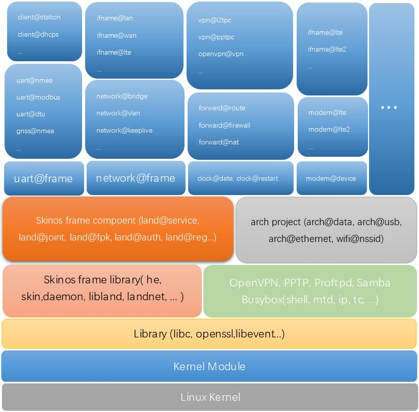

# brief 
The research and development of Internet edge computing based on Linux operating system makes innovative changes in both software and hardware to meet the diversified and complex needs of the market
- Software-based development of the **Software Foundation Development Platform**, which encapsulates embedded hardware in a unified way, providing a unified and scalable interface upwards 
- In terms of hardware, we develop highly integrated and interface-rich **routing modules** or **edge computing gateway modules**, and develop targeted routing products and terminal computing products based on modules 


# hardware product
The routing module is embedded in the customer's device or product to help it access the Internet and complete the calculation of business data related conversion and forwarding, triggering, timing task and so on  
- **LTE routing module**, **<[D218 Specifications](https://github.com/skinos7/doc/blob/master/product/d218/spec.md)>**
Provide LTE(4G) access, 2.4g WIFI(300M dual antenna) access or coverage, Ethernet (100M) access or out of the multi-functional and highly extensible routing module, and with double serial port (RS485/RS232/TTL three modes), multi-channel IO port and the corresponding data conversion and forwarding computing capabilities,  And provide a complete SDK and development interface, SDK has integrated a variety of control protocols can help developers to achieve local and remote control of this module  

- **NR(5G) routing module**, **<[D228 Specifications](https://github.com/skinos7/doc/blob/master/product/d228/spec.md)>**
Provide NR(5G) and LTE(4G) access, 5.8G WIFI(800M dual antenna) access or coverage, Ethernet (1000M) access or out of the multi-functional and highly extensible routing module,  And with three serial ports (RS485/RS232/TTL), multi-channel IO port and the corresponding data conversion and forwarding and other computing capabilities, and provides a complete SDK and development interface, SDK has integrated a variety of control protocols can help developers to achieve local and remote control of the module  

- **NR(5G)&WIFI6 gateway module**, **<[D618 Specifications](https://github.com/skinos7/doc/blob/master/product/d618/spec.md)>(*Data has not been uploaded yet*)**
Provide NR(5G) and LTE(4G) access, 5.8G WIFI6(1200M dual antenna) access or coverage, Ethernet (1000M) access or lead to the multi-functional and highly scalable routing module, with Bluetooth 5.0, CAN interface, HDMI2.0 audio and video output,  Audio input and output, MIPI-CSI camera head interface, USB2.0 interface (TYPE C), three serial ports (RS485/RS232/TTL), multi-channel IO interface and corresponding data conversion and forwarding and other computing capabilities, and provide a complete SDK and development interface,  SDK has integrated a variety of control protocols to help developers to achieve local and remote control of this module  


# Software base development platform
Using the functions provided by the Linux operating system, the various resources of embedded hardware are packaged into a relatively uniform development environment  
Strive to insert a development environment middle layer between embedded hardware and embedded software  
Stripping out development in two directions:
 - **Development environment** development: porting more embedded hardware platforms, packaging more hardware resources, providing more apis  
 - **Development of embedded application software** : based on the API provided by the development environment to develop more application logic, and application logic can also be convenient to provide interfaces to other applications in the way of API, all kinds of application logic can be very convenient to superimpose each other, to meet the various individual needs of customers  

Through the above means, the embedded application software developed based on the development environment has the following advantages：
- It can be transplanted to any embedded hardware platform supported by this development environment without code level modification, changing the status quo of repeated development and transplantation or adaptation in embedded  
- It is very convenient to provide various call interfaces externally
- Directly implement the corresponding management configuration or call its interface based on the protocol provided by the system  
- And save the r&d cost in the future update of embedded chip


# Software basic development platform download or update
#### 1. Development environment download
Under Ubuntu (20.04 or 18.04 is recommended), execute the following command to download the development environment (please install git and make first)
```shell
git clone https://github.com/skinos7/tiger7.git
```
After the above command is successfully completed, the tiger7 directory will be generated. This directory is the top-level directory of the development environment. Enter this directory
```shell
cd tiger7
```
Execute the following instructions to automatically install some tools required for compilation under Ubuntu
```
make ubuntu_preset
```
Execute the following command in the top-level directory of the development environment to specify the product model to be developed, and the following requires the input of **product complete model identify**
*There will be an example corresponding to the product on the **SDK** menu item page under the **Development** menu of the product's web management interface*
```shell
make pid gBOARDID=<product complete model identify>

# For D218 products, enter the following command to specify the product model:
# make pid gBOARDID=mtk-mt7628-d218

# For products such as D228, enter the following command to specify the product model:
# make pid gBOARDID=mtk-mt7621-d228

# For example, for V520 products, enter the following command to specify the product model:
# make pid gBOARDID=mtk-mt7621-v520
````
Then execute the following instructions to update the compilation environment and embedded application software corresponding to the product model
```shell
make update
````
Through the above five steps, the complete compilation environment and embedded application software corresponding to the product model can be updated
***Note: All subsequent execution commands of unnamed directories will be executed in the item level directory of the development environment, that is, the mytry6 directory in the example***

#### 2. Update menu and select Compile Embedded Application Package
```shell
make menu
````
will update the menu item before executing
```shell
make menuconfig
````
The software package menu corresponding to the product model is displayed, you can check or uncheck the software package, all the items of this system will be under the **Skin system(*Original Farm system*)** menu item
***Note: If you do not need to adjust the application functions on the product, please do not check or uncheck the operation, just exit directly***

#### 3. Compile the firmware
implement
```shell
make dep
make
````
The firmware upgrade package corresponding to the product model can be compiled. The firmware upgrade package ends with .zz and is stored in the build directory of the top-level directory.

#### 4. Upgrade the compiled firmware to the product
In the device web management interface, **System=>Software=>Update** to upgrade firmware with file that suffix be .zz
If you need to upgrade and restore the factory settings at the same time, you can change the suffix (.zz) of the firmware to .default and then upgrade through the web management interface.
***Note: After the firmware is upgraded, it may not start. If it does not start and the system light flashes slowly, please manually reset the device by pressing and holding the reset button for 5-8 seconds.***


# System Frame



# Component API
Component interfaces can be invoked either from the command line or through the development interface   
***Being refined, priority is given to commonly used components***  
- [Machine](https://github.com/skinos7/doc/blob/master/com/land/machine.md)
- [Date](https://github.com/skinos7/doc/blob/master/com/clock/date.md)
- [LTE Modem](https://github.com/skinos7/doc/blob/master/com/modem/lte.md)
- [LTE Network](https://github.com/skinos7/doc/blob/master/com/ifname/lte.md)
- [LAN Network](https://github.com/skinos7/doc/blob/master/com/ifname/lan.md)
- [WAN Network](https://github.com/skinos7/doc/blob/master/com/ifname/wan.md)
- [WISP Network](https://github.com/skinos7/doc/blob/master/com/ifname/wisp.md)


# Development guidance

- [Porject and Component Development](https://gitee.com/tiger7/doc/blob/master/dev/beginner_development.md)


---


# 简介
基于Linux操作系统的资源对边缘计算的研究及开发, 针对软件及硬件两个方面做出创新性的改变以适应市场多样化及复杂化的需求
- 软件开发 **软件基础开发平台**，对嵌入式硬件进行统一封装， 向用户及开发者提供统一且可扩展性的接口
- 硬件开发高度集成且接口丰富的 **路由模块** 或 **边缘计算网关模块**， 基于模块开发针对性的路由产品及终端计算产品原型, 并为高度市场化的原型产品设计专用硬件


# 硬件产品(路由模块)
用于嵌入于客户的设备或产品中帮助其接入互联网并完成业务数据相关的转换转发、触发、定时任务等计算, 或基于路由模块加上扩展板形成完整的路由器产品用于各种应用环境中
- **LTE路由模块** <[D218规格书](https://gitee.com/tiger7/doc/blob/master/product/d218/spec.md)>
    提供 LTE(4G)接入, 2.4G WIFI(300M双天线)接入或覆盖, 以太网(100M)接入或引出 的多功能高可扩展的路由模块, 并带有 双串口(RS485/RS232/TTL三模式)、多路IO口 及对应的数据转换转发等计算能力， 并提供完整的SDK及开发接口， SDK中已集成多种控制协议可帮助开发者实现本地及远程控制本模块
- **NR(5G)&WIFI5路由模块** <[D228规格书](https://gitee.com/tiger7/doc/blob/master/product/d228/spec.md)>
    提供 NR(5G)及LTE(4G)接入, 5.8G WIFI(800M双天线)接入或覆盖, 以太网(1000M)接入或引出 的多功能高可扩展的路由模块, 并带有 三串口(RS485/RS232/TTL)、多路IO口 及对应的数据转换转发等计算能力， 并提供完整的SDK及开发接口， SDK中已集成多种控制协议可帮助开发者实现本地及远程控制本模块
- **NR(5G)&WIFI6边缘计算网关模块** <[D618规格书](https://gitee.com/tiger7/doc/blob/master/product/d618/spec.md)>(*资料暂暂未上传*)
    提供 NR(5G)及LTE(4G)接入, 5.8G WIFI6(1200M双天线)接入或覆盖, 以太网(1000M)接入或引出 的多功能高可扩展的路由模块, 并带有 蓝牙5.0、CAN接口、HDMI2.0音视频输出, 音频输入输出、MIPI-CSI摄象头接口、USB2.0接口(TYPE C)、三串口(RS485/RS232/TTL)、多路IO口 及对应的数据转换转发等计算能力， 并提供完整的SDK及开发接口， SDK中已集成多种控制协议可帮助开发者实现本地及远程控制本模块


# 软件基础开发平台
使用Linux操作系统提供的各项功能, 将嵌入式硬件的各种资源包装成相对统一的 **开发环境**
致力在嵌入式硬件与软件之间插入 **开发环境** 中间层系统
剥离出两种方向的开发:
 - **开发环境** 的开发: 移植更多的嵌入式硬件平台, 封装更多硬件资源, 提供更多的组件API
 - **应用软件** 的开发: 基于开发环境提供的组件API开发更多的应用逻辑, 且应用逻辑也可以方便的以组件API的方式向其它应用提供接口, 各种应用逻辑可以很方便的相互叠加, 满足客户的各种个性需求

通过以上方式使得基于本 **开发环境** 开发的 **应用软件**, 据有以下优势：
- 可以无代码级修改的移植到本开发环境支持的任意嵌入式硬件平台中, 改变嵌入式中重复开发及移植或适配现状
- 可以非常方便的向外提供各种调用接口
- 基于系统向外提供的协议直接实现对应管理配置或调用其接口
- 并在未来的嵌入式芯片更新换代中节约研发成本

**软件基础开发平台** 包含有 **开发环境** 跟产品对应的 **应用软件**, 我们称之为 **Skin SDK**
***注意: 本软件基础开发平台不支持升级到未援权的硬件上, 否则将造成硬件的损坏***


# 软件基础开发平台下载或更新 

#### 1. 开发环境下载
在Ubuntu下（建议使用20.04或18.04）执行以下命令下载开发环境(请先安装git及make)
```shell
git clone https://gitee.com/tiger7/tiger7.git
```
以上指令成功完成后会生成tiger7目录, 此目录是开发环境的顶层目录, 进入此目录
```shell
cd tiger7
```
执行以下指令可在Ubuntu下自动安装一些编译需要的工具
```shell
make ubuntu_preset
```
在开发环境的顶层目录下执行以下指令来指定要开发的产品型号， 以下要求输入的 **产品完整型号**
*在产品的管理界面的 **定制开发** 菜单下的 **SDK下载** 菜单项页面上会有产品对应的示例*
```shell
make pid gBOARDID=产品完整型号

# 如D218的产品输入以下指令指定产品型号:
# make pid gBOARDID=mtk-mt7628-d218

# 如D228的产品输入以下指令指定产品型号:
# make pid gBOARDID=mtk-mt7621-d228

# 如V520的产品输入以下指令指定产品型号：
# make pid gBOARDID=mtk-mt7621-v520
```
之后再执行以下指令来更新产品型号对应的编译环境及嵌入式应用软件
```shell
make update
```
通过以上五步即可更新产品型号对应的完整的编译环境及嵌入式应用软件
***注意: 以后所有未指名目录的执行命令都表示在开发环境的项层目录执行, 即示例中的tiger7目录***

#### 2. 更新菜单并选择编译嵌入式应用软件包
执行 
```shell
make menu
```
将会更新菜单项, 之后再执行 
```shell
make menuconfig
```
显示出产品型号对应的软件包菜单， 可进去勾选或去勾选软件包, 所有本系统的项目都会在 **Skin system** 菜单项下
***注意: 如果不需要调整产品上的应用功能请不要勾选或去勾选操作, 直接退出即可***

#### 3. 编译固件 
执行
```shell
make dep
make
```
即可编译产品型号对应的固件升级包， 固件升级包以.zz结尾， 存放在顶层目录的build目录下

#### 4. 将编译出来的固件升级到产品上
在设备网页管理界面中的 **系统=>软件管理=>软件更新** 来点选.zz结尾的固件升级包来升级固件
如需升级的同时恢复出厂设置可将固件的后缀名(.zz)修改为.default后现通过网页管理界面升级即可


# 系统框架


# 组件API
组件接口可以从命令行调用，也可以通过开发接口调用   
***正在编写中,  优先给出常用的组件接口***  
- [Machine](https://gitee.com/tiger7/doc/blob/master/com/land/machine.md)
- [Date](https://gitee.com/tiger7/doc/blob/master/com/clock/date.md)
- [LTE Modem](https://gitee.com/tiger7/doc/blob/master/com/modem/lte.md)
- [LTE Network](https://gitee.com/tiger7/doc/blob/master/com/ifname/lte.md)
- [LAN Network](https://gitee.com/tiger7/doc/blob/master/com/ifname/lan.md)
- [WAN Network](https://gitee.com/tiger7/doc/blob/master/com/ifname/wan.md)
- [WISP Network](https://gitee.com/tiger7/doc/blob/master/com/ifname/wisp.md)


# 开发指导

- [项目及组件开发](https://gitee.com/tiger7/doc/blob/master/dev/beginner_development.md)
